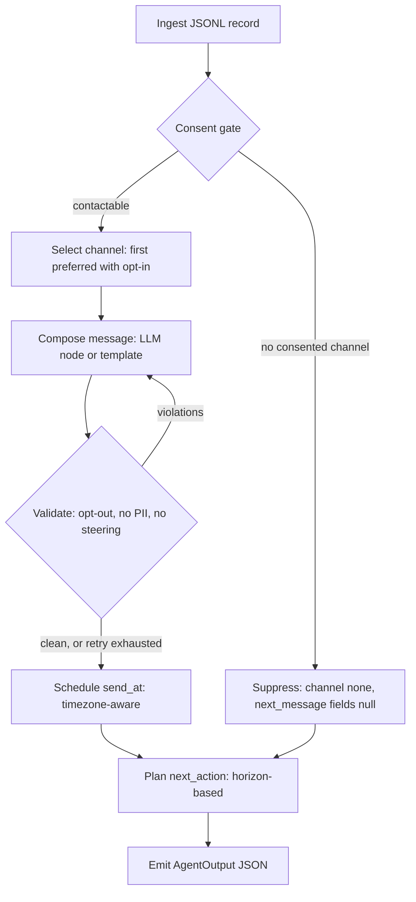

<div align="center">

# Next-Best-Message Agent

**RealPage take-home: a context-aware, autonomous message-sending agent.**


</div>

Given a JSONL record of a prospect's profile, consent, and context, the
agent decides **whether** to communicate, **how** (channel), **when** (send
time), and **what** to say — then emits structured output that semantically
matches the graded expectation. Every decision except the message's prose is
deterministic, unit-tested code; the LLM is confined to a single
"compose the prose" node behind an interface, with a validator standing
between it and the outside world.

## Architecture



Every box above is one small, single-responsibility class behind its own
interface — swappable and independently unit-tested. Full sequence diagram,
interface table, and the SOLID mapping: [docs/DESIGN.md](docs/DESIGN.md).

## Layout

| Path | What it is |
|---|---|
| `src/Agent` | The library: domain records, decision logic, composition, safety. No I/O beyond the completion client. |
| `src/Agent.Cli` | Console entry point — thin shell over `Agent`. |
| `tests/Agent.Tests` | xUnit tests. One suite, 100% line/branch/method coverage, enforced as a build-breaking gate (not just reported). |
| `docs/` | Design, operations, code-review-process, and retrospective documentation (see below). |

## Getting started

```bash
dotnet build      # builds the whole solution (.slnx)
.\test.ps1        # runs the suite with the coverage gate; fails the build under 100%
```

The end-to-end CLI (`dotnet run --project src/Agent.Cli -- --input sample.jsonl --output out.json`)
is the full pipeline; see [TalkingPoints.md](TalkingPoints.md) for one sentence per decision. Input stays JSONL (that part is in
`problem_statement.txt`); output is a single indented JSON array, not JSONL — readability
mattered more than a self-imposed symmetry once we noticed the problem statement never
required it.

Add `--now <ISO-8601 date-time>` to fix the run's reference time (send days are floored
to it and horizons counted from it); without it the current UTC time is used. The run
against the twelve-record evaluation set is
`--input holdout_12.jsonl --now 2025-12-09T00:00:00-06:00`, the oracle's own date. That
file is an evaluation set, never fitted to: the two records in `sample.jsonl` are the only
evidence any rule is fitted to (decision D9 in
[docs/DECISION_LOG.md](docs/DECISION_LOG.md)). A third set, `synthetic_12.jsonl`
(`--now 2026-03-07T12:00:00Z`), holds one record per case the samples cannot decide, plus one
malformed line. After Sprint 3 the scorer covers every field of the label.

The tallies below are from runs with the template composer and outbound HTTPS blocked. The
hold-out passes channel on 12 of 12, send day on 7 of 11, send hour on 5 of 11, action type
on 7 of 12, opt-out on 11 of 11, call-to-action type on 7 of 11, call-to-action payload on
11 of 11, language on 11 of 11, safety on 12 of 12, and personalization on 8 of 8, at a batch
p95 latency of 18 ms; 4 of 12 records pass every check. The synthetic set passes 12 of 12 and
exits 2 for its one malformed line by design; `sample.jsonl`, the fitted set, passes 2 of 2.
What moved since the last published numbers: call-to-action payload from 0 of 2, 0 of 11 and
0 of 10, because the composers now take the reply options and the email link path from the
catalog's call-to-action column (D25); language on the hold-out from 10 of 11 and on the
synthetic set from 9 of 10, because the offline composer ships an English and a Spanish
template set keyed on the language tag (D26); and the overall count from 0 of 2, 1 of 12 and
2 of 12. `ActionSem` and `BodySem` read 0 of 0 on all three: the judge is off unless `--judge`
is passed (D30). Every tally is in [docs/DESIGN.md](docs/DESIGN.md) section 9 and pinned in
the suite. Measurements, not targets.

Add `--eval-report <file>` against a labeled file (one with `expected` populated) to get
the scorecard: one row per record with a verdict per check (channel, send day and hour,
action type, opt-out, call-to-action type and payload, language, safety, personalization),
a per-check tally line, the batch p95 latency, and the overall count, printed to the console
and written to that file. `n/a` means not measured. Add `--replay <output.json>` in place of
`--output` to re-score an existing output file without running the agent.

Add `--judge` to put two more checks on that scorecard, `ActionSem` and `BodySem`: a pinned
model grades the produced message against the label's own action and body, under a pinned
rubric (D30). It is off by default, needs `OpenAI:ApiKey` in `dotnet user-secrets`, and makes
one model call per scoreable record. Its verdicts are their own checks and never decide
whether a record passes, and an offline run reports both as `n/a`.

Add `--log-file <file>` for a real, structured log of what the process did
while producing that output - full flag reference, log format, and how to
debug a bad run: [docs/OPERATIONS.md](docs/OPERATIONS.md).

## Documentation

- [docs/DESIGN.md](docs/DESIGN.md) — architecture, interface table, inferred decision rules and their evidence, assumptions log, security/governance posture.
- [docs/OPERATIONS.md](docs/OPERATIONS.md) — how to run it, how to debug a bad run, how the logging actually works, and how to read one log line.
- [TalkingPoints.md](TalkingPoints.md) - one sentence per decision, grouped from the 60-second answer down; the walkthrough script.
- [docs/CODE_REVIEW.md](docs/CODE_REVIEW.md) — what the two automated PR reviewers check for, and the scope decisions they should not re-flag.
- [docs/RETROSPECTIVE_2026-09-06.md](docs/RETROSPECTIVE_2026-09-06.md) - why the hold-out scored 2 of 12, decisions D1 to D8, and the plan to completion.

## Engineering notes

Built test-first throughout: a failing test before any implementation, every
sprint landing as its own PR with a 100%-coverage gate. A few of the more
interesting calls, in brief (one sentence each in TalkingPoints.md, evidence in docs/RETROSPECTIVE_2026-09-06.md):

- **`.slnx`** instead of a legacy `.sln` — plain XML, no GUID soup.
- **Central package management** (`Directory.Packages.props`) — one place for every dependency's version.
- **`System.Text.Json` with `JsonNamingPolicy.SnakeCaseLower`** for the snake_case JSONL schema — no per-property attribute mapping needed for the vast majority of fields.
- **`[GeneratedRegex]`** (source-generated, not `new Regex(...)`) for the safety validator's PII patterns.
- **`Option<T>` / `Result<T>`** in `Agent.Common` instead of nulls or thrown exceptions for expected "no value" / "expected failure" cases.
- Domain types never reuse .NET BCL names (caught and fixed a real `Channel` vs. `System.Threading.Channels.Channel` collision during Sprint 1).
