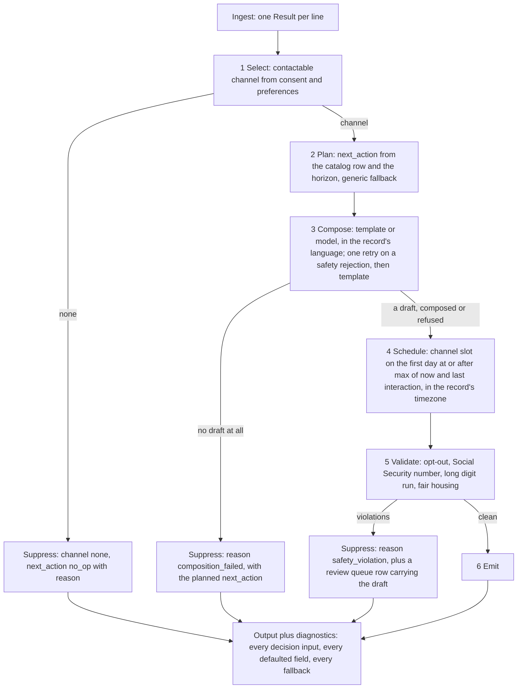

<div align="center">

# Next-Best-Message Agent

**RealPage take-home: a context-aware, autonomous message-sending agent.**


</div>

Given a JSONL record of a prospect's profile, consent, and context, the
agent decides **whether** to communicate, **how** (channel), **when** (send
time), and **what** to say — then emits structured output that semantically
matches the graded expectation. Every decision except the message's prose is
deterministic, unit-tested code; the LLM is confined to a single
"compose the prose" node behind an interface, with a validator standing
between it and the outside world.

## Architecture



Three components sit behind an interface, and only those three: the message composer
and the safety validator, which are the Compose and Validate boxes above, and the
completion client the model composer calls, which has no box of its own because it sits
inside Compose. Each of the three has a real implementation and an offline one, which is
what earns the interface; every other component above is a concrete class its caller
names by type. All of them are independently unit-tested either way. The component
table, the seam column, and the two decisions that removed the other seven interfaces
(D57 for the consent gate, D58 for the remaining six): [docs/DESIGN.md](docs/DESIGN.md).

## Layout

| Path | What it is |
|---|---|
| `src/Agent` | The library: domain records, decision logic, composition, safety. No I/O beyond the completion client. |
| `src/Agent.Cli` | Console entry point — thin shell over `Agent`. |
| `tests/Agent.Tests` | xUnit tests. One suite, 100% line/branch/method coverage, enforced as a build-breaking gate (not just reported). |
| `docs/` | Design, operations, code-review-process, and retrospective documentation (see below). |

## Getting started

```bash
dotnet build      # builds the whole solution (.slnx)
.\test.ps1        # runs the suite with the coverage gate; fails the build under 100%
```

The end-to-end CLI (`dotnet run --project src/Agent.Cli -- --input sample.jsonl --output out.json`)
is the full pipeline; see [TalkingPoints.md](TalkingPoints.md) for one sentence per decision. Input stays JSONL (that part is in
`problem_statement.txt`); output is a single indented JSON array, not JSONL — readability
mattered more than a self-imposed symmetry once we noticed the problem statement never
required it.

Add `--now <ISO-8601 date-time>` to fix the run's reference time (send days are floored
to it and horizons counted from it); without it the current UTC time is used. The run
against the twelve-record evaluation set is
`--input holdout_12.jsonl --now 2025-12-09T00:00:00-06:00`, the oracle's own date. That
file is an evaluation set, never fitted to: the two records in `sample.jsonl` are the only
evidence any rule is fitted to (decision D9 in
[docs/DECISIONS_ARCHIVE.md](docs/DECISIONS_ARCHIVE.md)). A third set, `synthetic_12.jsonl`
(`--now 2026-03-07T12:00:00Z`), holds one record per case the samples cannot decide, plus one
malformed line. After Sprint 3 the scorer covers every field of the label.

The tallies below are from runs made on 2026-09-09 at the documented reference times with the
template composer, which makes no network call at all. The hold-out passes channel on 12 of 12,
send day on 7 of 11, send hour on 5 of 11, action type on 7 of 12, opt-out on 11 of 11,
call-to-action type on 7 of 11, call-to-action payload on 11 of 11, language on 11 of 11, safety
on 12 of 12, and personalization on 8 of 8; 4 of 12 records pass every check and the run exits 0.
The synthetic set passes every check on all 12 records that parse, and its one malformed line is
an `ERROR` row of the scorecard (D71), so it reads 12 of 13 and exits 2 by design; `sample.jsonl`, the fitted set, passes 2 of 2 on every check. Zero safety violations on
all three, and the review queue is empty on all three. `ActionSem` and `BodySem` read 0 of 0
everywhere: the judge is off unless `--judge` is passed (D30). Nothing has moved since Sprint 6,
which is when call-to-action payload went from 0 of 2, 0 of 11 and 0 of 10 (D25) and language from
10 of 11 and 9 of 10 (D26); Sprint 7 changed how a violation is found and surfaced and Sprint 8
changed the shape of the code, and neither changed which messages pass. Every tally is in
[docs/DESIGN.md](docs/DESIGN.md) section 9 and pinned in the suite. Measurements, not targets.

Two numbers for what a batch costs. **Latency:** the batch p95 is around 20 ms on each of the
three sets, against the 2000 ms budget the records themselves state. Unlike every tally above it,
this figure is wall clock: it is not pinned in the suite and it moves between runs on the same
code, so read it as a magnitude rather than a number your own run will match to the millisecond.
Runs of the three documented commands on unchanged code have read p95s anywhere from 19 ms to
23 ms. What does reproduce is the shape: on each set exactly one record pays the one-time
just-in-time compilation cost and reads around 20 ms, which is what makes it that set's p95,
and every other record reads single-digit milliseconds. **Money:** the default path costs
nothing, because it makes no request and needs no key. The first live run this project made,
`--composer openai` across all three sets on 2026-09-08, cost about $0.004 read off the vendor's
own usage page rather than estimated, roughly $0.00017 per record, and the model wrote none of the
text: every call was abandoned at the 1000 ms attempt timeout the client then used and the
template answered, which is what the
fallback is for (D31, and the arithmetic in [docs/DESIGN.md](docs/DESIGN.md) section 9). That
dollar figure is dated prose and stays dated prose; what the program measures is tokens. On
2026-09-10 the model answered for the first time, under `--model-call-budget-ms 30000` (D70): on
`synthetic_12.jsonl` it wrote 8 of the 10 messages in 19 calls, 7,479 input and 2,129 output
tokens, at a p95 of 8,043 ms, which fails the records' own 2000 ms, and the call-to-action check
fell to 9 of 10 ([docs/scorecards/synthetic_12_openai_run1.txt](docs/scorecards/synthetic_12_openai_run1.txt)).
Once code took over the opt-out sentence and the unstated call to action (D72, D73), three more
runs had the model write all 10 in 10 calls, 3,900 input and about 980 output tokens, every check
at the template's level, and a p95 of 2.3 to 4.5 seconds, still over 2000 ms
([docs/VARIANCE.md](docs/VARIANCE.md)).
`diagnostics.model_cost` carries the vendor's own input and output token counts for
each record, null when no model call was made at all and a counted call with zero tokens when one
was abandoned at its timeout, and the scorecard's `Batch model cost:` line is the batch total
(D62). A price constant in code is a fact about a vendor's web page that no test here could tell
stale from current, so today's money is today's published price times the tokens a run reports.

Add `--eval-report <file>` against a labeled file (one with `expected` populated) to get
the scorecard: one row per record with a verdict per check (channel, send day and hour,
action type, opt-out, call-to-action type and payload, language, safety, personalization),
a per-check tally line, the batch p95 latency, and the overall count, printed to the console
and written to that file. `n/a` means not measured. Add `--replay <output.json>` in place of
`--output` to re-score an existing output file without running the agent.

Add `--judge` to put two more checks on that scorecard, `ActionSem` and `BodySem`: a pinned
model grades the produced message against the label's own action and body, under a pinned
rubric (D30). It is off by default, needs `OpenAI:ApiKey` in `dotnet user-secrets`, and makes
one model call per scoreable record. Its verdicts are their own checks and never decide
whether a record passes, and an offline run reports both as `n/a`.

Add `--log-file <file>` for a real, structured log of what the process did
while producing that output - full flag reference, log format, and how to
debug a bad run: [docs/OPERATIONS.md](docs/OPERATIONS.md).

## Documentation

- [docs/DESIGN.md](docs/DESIGN.md) - architecture, the component table and its seam column, inferred decision rules and their evidence, assumptions log, security/governance posture.
- [docs/NARRATION.md](docs/NARRATION.md) - the seven-question script for explaining this system out loud, plus one record walked file by file through the six steps.
- [docs/RUNBOOK.md](docs/RUNBOOK.md) - one screen: set the secret, build and test, run, open the scorecard, read a log line, replay.
- [docs/OPERATIONS.md](docs/OPERATIONS.md) — how to run it, how to debug a bad run, how the logging actually works, and how to read one log line.
- [TalkingPoints.md](TalkingPoints.md) - one sentence per decision, grouped from the 60-second answer down; the walkthrough script.
- [docs/CODE_REVIEW.md](docs/CODE_REVIEW.md) — what the two automated PR reviewers check for, and the scope decisions they should not re-flag.
- [docs/RETROSPECTIVE_2026-09-06.md](docs/RETROSPECTIVE_2026-09-06.md) - why the hold-out scored 2 of 12, decisions D1 to D8, and the plan to completion.

## Engineering notes

Built test-first throughout: a failing test before any implementation, every
sprint landing as its own PR with a 100%-coverage gate. A few of the more
interesting calls, in brief (one sentence each in TalkingPoints.md, evidence in docs/RETROSPECTIVE_2026-09-06.md):

- **`.slnx`** instead of a legacy `.sln` — plain XML, no GUID soup.
- **Central package management** (`Directory.Packages.props`) — one place for every dependency's version.
- **`System.Text.Json` with `JsonNamingPolicy.SnakeCaseLower`** for the snake_case JSONL schema — no per-property attribute mapping needed for the vast majority of fields.
- **`[GeneratedRegex]`** (source-generated, not `new Regex(...)`) for the safety validator's PII patterns.
- **`Option<T>` / `Result<T>`** in `Agent.Common` instead of nulls or thrown exceptions for expected "no value" / "expected failure" cases.
- Domain types never reuse .NET BCL names (caught and fixed a real `Channel` vs. `System.Threading.Channels.Channel` collision during Sprint 1).
