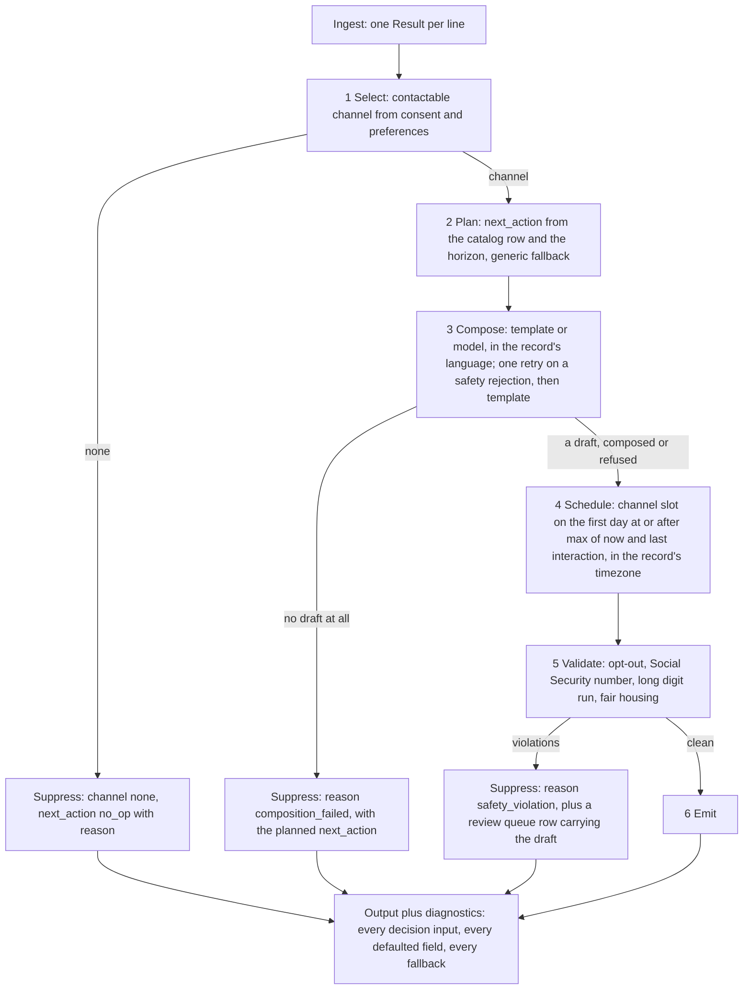

# Next-Best-Message Agent

A .NET 10 command-line tool written for a leasing take-home. It reads prospect records as JSONL
and decides, for each one, whether to send a message, on which channel, at what time, and what
it says, then writes `next_message` and `next_action` for every record. Code makes every
decision. A language model, when one is asked for, writes the prose only, behind the
`IMessageComposer` interface, and a safety gate checks every draft before it can ship. The
default composer is a template: it makes no network call and needs no key.

## Pipeline

Steps 1 to 6 are `LeasingMessageAgent.RunAsync` (`src/Agent/Orchestration/`), numbered in the
order it executes them (D59). `CliRunner` reads the input, runs up to four records at once (D37)
and writes every output in input order.



Step 3 is `ValidatingMessageComposer`: at most two composer attempts, the second only after a
safety rejection, then the template (D34). Step 5 also checks brand style, recorded and never a
gate (D39). Components and the three interfaces: [docs/DESIGN.md](docs/DESIGN.md) section 5.

## Run

From the repository root, with the .NET 10 SDK:

```bash
dotnet build
dotnet run --project src/Agent.Cli -- --input sample.jsonl --output out.json --now 2025-12-09T00:00:00-06:00
```

`--now` is the run's reference time (D10), default the current UTC time. The output is one
indented JSON array. Exit codes: 0 success, 1 usage error, 2 a line that did not parse or a
record that threw. `--diagnostics`, `--review-queue` and `--log-file` add why each decision was
made, what the safety gate rejected, and a structured log. Every flag:
[docs/OPERATIONS.md](docs/OPERATIONS.md). `.\test.ps1` runs the tests under a 100 percent line,
branch and method coverage gate. The model key and reading a log line:
[docs/RUNBOOK.md](docs/RUNBOOK.md).

## Evaluate

```bash
dotnet run --project src/Agent.Cli -- --input holdout_12.jsonl --output out.json --now 2025-12-09T00:00:00-06:00 --eval-report eval.txt
dotnet run --project src/Agent.Cli -- --input synthetic_12.jsonl --output out-synthetic.json --now 2026-03-07T12:00:00Z --eval-report eval-synthetic.txt
dotnet run --project src/Agent.Cli -- --input holdout_12.jsonl --replay out.json --eval-report eval-replay.txt
```

`--eval-report` scores each record against its own `expected` label: `OK`, `FAIL` or `n/a` (not
measured, never a pass) per check, a per-check tally, the batch p95 against the records' 2000 ms
budget, and the overall count. `--replay` re-scores an output file without running the agent
(D14); `--judge` adds two model-graded checks and needs the key (D30). `sample.jsonl` is the only
evidence any rule is fitted to; the other two sets are run and reported, never fitted to (D9).

| Set, template composer | Overall | Checks below full | Source |
|---|---|---|---|
| `sample.jsonl` | 2 of 2 | none | [docs/DESIGN.md](docs/DESIGN.md) section 9, Sprint 9 |
| `holdout_12.jsonl` | 4 of 12 | day 7 of 11, hour 5 of 11, action 7 of 12, call-to-action type 7 of 11 | [docs/DESIGN.md](docs/DESIGN.md) section 9, Sprint 9 |
| `synthetic_12.jsonl` | 12 of 13 | none; line 11 is malformed by design, an `ERROR` row (D71), exit 2 | [docs/scorecards/synthetic_12_template.txt](docs/scorecards/synthetic_12_template.txt) |

The hold-out misses are the oracle's per-stage send days and hours (A5) and vocabulary the two
samples never showed (A8, A9). All three sets record zero safety violations and an empty review
queue; the batch p95 read 19 to 22 ms, wall clock that moves between runs (DESIGN.md section 9).
`BaselineNumbersTests` pins every tally, so a drop fails the build.

The model path, `--composer openai --model-call-budget-ms 30000` (D70) on `synthetic_12.jsonl`,
scored 12 of 13 on each of three runs after D72 and D73, in 10 calls and 3,900 input tokens a
run, p95 2,318 to 4,508 ms, over the 2000 ms budget. Refused drafts fell from 33 across the three
runs before to 0. It beats the template on no scored check ([docs/VARIANCE.md](docs/VARIANCE.md)).

## Assumptions

Twenty-three assumptions, A1 to A23, each with its evidence and whether it is configurable, are the
table in [docs/DESIGN.md](docs/DESIGN.md) section 7; every rule cites one. The ones that decide
most outputs:

- A1 to A3: the channel is the first opted-in entry of `channel_preferences`; with none, channel `none` and `no_op`.
- A4 to A6: the first day at or after the later of `--now` and `last_interaction`, in the record's timezone (UTC when unknown); sms and voice 09:00, email 10:00.
- A7, A8: a move date at most 45 days out gives `start_cadence`, else `follow_up_in_days` 3; an unknown persona or stage uses the generic row.
- A13, A18: the template writes English and Spanish, any other language in English with a diagnostic; the model writes prose only, and the template is the fallback.

## Documentation

- [docs/DESIGN.md](docs/DESIGN.md): rules and their evidence, components, assumptions, the numbers per sprint.
- [docs/OPERATIONS.md](docs/OPERATIONS.md), [docs/RUNBOOK.md](docs/RUNBOOK.md): every flag and exit code, debugging, the one-screen run.
- [docs/VARIANCE.md](docs/VARIANCE.md), [docs/scorecards/](docs/scorecards/), [docs/FAULT_INJECTION.md](docs/FAULT_INJECTION.md): the Phase 7 evidence.
- [docs/DECISION_LOG.md](docs/DECISION_LOG.md): the current phase, one paragraph per sprint; [docs/DECISIONS_ARCHIVE.md](docs/DECISIONS_ARCHIVE.md): every D and S number in full.
- [docs/NARRATION.md](docs/NARRATION.md): one record walked through the code; [docs/CODE_REVIEW.md](docs/CODE_REVIEW.md): the deliberate scope-outs.
