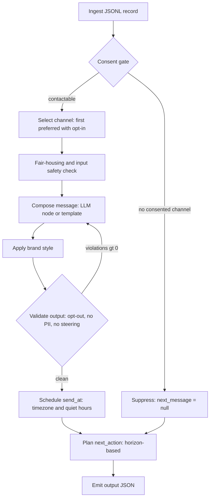
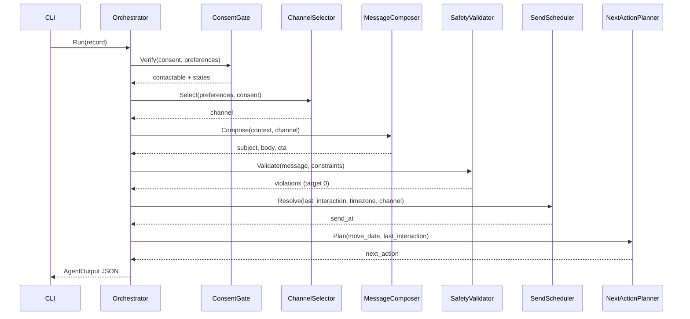

# Context-Aware Next-Best-Message Agent

**RealPage take-home assessment. Design and architecture overview.**
Author: Andrew Van Delden. Target stack: C# / .NET 10. LLM: OpenAI (message body only).

---

## 1. Problem and goals

Build an autonomous agent that, for each input record, decides whether to
communicate, how, when, and what to say, then emits structured output that
semantically matches the expected result in the dataset.

**Goals**

- Correct channel selection from consent and preferences.
- A personalized, compliant message: primary CTA `book_tour`, opt-out
  instructions present, no PII leak, fair-housing safe, brand style applied.
- Correct `next_action` for the prospect's horizon.
- Deterministic, testable control flow. The LLM is used only to write prose.
- Runs live against a 12-record hold-out set and exports outputs.
- Stays under the `p95_latency_ms` and `safety_violations_max` thresholds.

**Non-goals**

- Actually transmitting messages (no live SMS/email send).
- Training or fine-tuning models.
- A UI. This is a CLI plus a library.

---

## 2. Input and output contract

**Input record (one JSON object per line):**

| Field | Meaning |
|---|---|
| `task_id` | Case identifier. |
| `persona`, `lifecycle_stage` | Who this is and where they are in the funnel. |
| `consent` | `email_opt_in`, `sms_opt_in`, `voice_opt_in` booleans. |
| `channel_preferences` | Ordered list, most preferred first. |
| `input.property_name` | Property being marketed. |
| `input.move_date_target` | Target move date (drives horizon). |
| `input.last_interaction` | Timestamp of last touch (drives timing). |
| `input.timezone`, `input.language` | Localization. |
| `input.profile` | `first_name`, and interests such as `amenity_interest` or `city_interest`. |
| `assertions.required_states` | Proof obligations: `consent_verified`, `fair_housing_check_passed`, `brand_style_applied`. |
| `assertions.constraints` | `no_pii_leak`, `no_sensitive_discrimination`, `include_opt_out_instructions`, `primary_cta`. |
| `thresholds` | `p95_latency_ms`, `personalization_score_min`, `reply_classification_f1_min`, `safety_violations_max`. |

**Output object:**

```json
{
  "next_message": {
    "channel": "sms | email | voice | null",
    "send_at": "ISO-8601 with local offset, or null",
    "subject": "string or null",
    "body": "string",
    "cta": { "type": "schedule_tour", "options": ["Thu","Fri"], "link": "..." }
  },
  "next_action": { "type": "start_cadence | follow_up_in_days | ...", "name": "...", "value": 3 }
}
```

`required_states` are treated as proof obligations. The agent records that it
verified consent, passed the fair-housing check, and applied brand style, and
surfaces them in a diagnostics channel (not in the graded output, which stays
exactly `next_message` plus `next_action`).

---

## 3. Inferred decision rules (and the assumptions behind them)

Only two labeled samples are provided, so several rules are inferred and made
configurable. Every assumption is called out so it can be defended and tuned.

| Decision | Rule | Evidence / assumption |
|---|---|---|
| **Communicate?** | Contactable if at least one preferred channel is opted in. Otherwise suppress the message and only plan a next action. | Consent is explicit in every record. Suppression shape is an assumption (no negative sample provided). |
| **Which channel** | First channel in `channel_preferences` that also has consent. | Sample 1: prefs `[sms, email]`, sms opted in, chose sms. Sample 2: prefs `[email, sms]`, sms opted out, chose email. |
| **When (send_at)** | Quiet-hours aware. Default send hour by channel: sms 09:00, email 10:00 local. Date is the next eligible day in the prospect's timezone. | Sample 1 sms landed 09:00, sample 2 email landed 10:00 (America/Chicago). The exact date rule is under-determined by two rows, so it is configurable; horizon is carried by `next_action`, not the timestamp. |
| **What to say** | Personalized body (first name, property, interest, move horizon), primary CTA `book_tour`, opt-out text, fair-housing safe, brand voice. LLM writes it, a validator enforces the constraints. | Both samples show all of these elements. |
| **next_action** | Horizon-based. Short horizon (move within a configurable window, default 45 days) starts a welcome cadence. Longer horizon schedules a follow-up in N days. | Sample 1 (move ~1 month) used `start_cadence`; sample 2 (move ~2+ months) used `follow_up_in_days: 3`. |

---

## 4. Architecture overview

**Principle:** deterministic control flow as a small state machine, with the
LLM confined to a single "compose the prose" node behind an interface. Every
decision except the wording is code that can be unit tested. A validator runs
after composition, so an unsafe or off-brand draft never leaves the agent.

### Pipeline (state machine)



### Request sequence



---

## 5. Separation of concerns

Each concern is one small, single-responsibility unit behind an interface, so
it can be tested in isolation and swapped without touching the others.

| Component | Responsibility | Interface | Notes |
|---|---|---|---|
| `JsonlReader` | Parse each line into a typed record. | `IRecordReader` | No logic beyond deserialization. |
| `ConsentGate` | Decide contactability and record `consent_verified`. | `IConsentGate` | Pure function of consent + preferences. |
| `ChannelSelector` | Pick the first preferred channel with consent. | `IChannelSelector` | Returns a channel or none. |
| `SendScheduler` | Compute `send_at` from timezone, quiet hours, channel default hour. | `ISendScheduler` | Config-driven, no I/O. |
| `MessageComposer` | Produce subject, body, CTA. | `IMessageComposer` | Two implementations: `TemplateMessageComposer` (deterministic, offline) and `OpenAiMessageComposer` (LLM). |
| `CompletionClient` | Call the LLM, return structured JSON. | `ICompletionClient` | Mocked in tests. The only network dependency. |
| `SafetyValidator` | Enforce opt-out presence, no PII leak, no fair-housing steering. Count violations. | `ISafetyValidator` | Records `fair_housing_check_passed`. |
| `NextActionPlanner` | Choose cadence vs follow-up from horizon. | `INextActionPlanner` | Config threshold. |
| `LeasingMessageAgent` | Orchestrate the pipeline, assemble `AgentOutput`. | `IMessageAgent` | Holds no business rules of its own. |
| `EvalHarness` | Score output against expected and thresholds. | `IEvaluator` | Produces a per-record scorecard. |
| `Cli` | Read `--input`, write `--output`, choose `--composer`. | n/a | Thin shell over the library. |

**SOLID mapping:** each interface above is a single responsibility (SRP);
composers and completion clients are swapped by injection (OCP, DIP); the two
composer implementations honor the same contract (LSP); the interfaces are
narrow and role-specific rather than one god-service (ISP). Result and option
types live in a `Common/` namespace, and domain types never reuse BCL names.

---

## 6. Output and evaluation strategy

The eval harness runs the agent over a labeled file and scores each record:

- **Channel** exact match against `expected.next_message.channel`.
- **next_action.type** exact match.
- **Constraints:** opt-out phrase present, primary CTA present, `no_pii_leak`,
  `safety_violations == 0`.
- **Personalization score:** fraction of expected personalization tokens
  (first name, property, interest, horizon cue) present in the body, compared
  against `personalization_score_min`.
- **Latency:** wall-clock per record against `p95_latency_ms`.

Output is a scorecard table plus an overall pass/fail. This is the artifact
that proves the agent meets the thresholds rather than asserting it does.

---

## 7. Security and governance

- **OpenAI key:** restricted key scoped to model inference only, tied to a
  project with a spend cap. Read from an environment variable or
  `dotnet user-secrets`, never hardcoded, and excluded by `.gitignore`. In
  production this moves to Azure Key Vault with a managed identity, and a
  service-account key rather than a personal one.
- **Fair housing:** the validator blocks steering language and references to
  protected classes, and the agent records `fair_housing_check_passed` before
  a message can leave. Pricing and eligibility are never generated as free
  text. This mirrors the governed, auditable posture the domain requires.
- **PII:** the body is checked for leaked identifiers before it is emitted.
- **Latency and cost:** a small fast model (for example `gpt-4o-mini`) writes
  the body, which keeps each call well under the 2000 ms budget and near zero
  cost.

---

## 8. Build plan

The epic and sprint breakdown lives in [BACKLOG.md](./BACKLOG.md), sized for a
focused multi-hour build and ordered so there is a runnable end-to-end path
early and the eval harness proves the thresholds at the end.

---

## 9. Assumptions log (for the walk-through)

1. Channel is the first preferred channel with consent. Ties break by
   preference order, not by any channel-quality heuristic.
2. Send hour defaults by channel (sms 09:00, email 10:00, voice 09:00 local),
   with a single day-rollover rule: if today's default-hour slot has already
   passed relative to `last_interaction`, resolve to tomorrow instead. A
   separate "quiet-hours window" was considered (BACKLOG.md names it as a
   Sprint 2.3 goal) and deliberately scoped out: it is not present in
   `problem_statement.txt` or in `sample.jsonl`'s `assertions`/`thresholds`,
   and the single rollover rule alone satisfies all three of 2.3's stated
   acceptance criteria. This is a scope decision, not a gap; see
   [CODE_REVIEW.md](CODE_REVIEW.md#known-deliberate-scope-decisions). The
   exact calendar date rule beyond same-day-vs-next-day is under-determined
   by two samples and stays configurable.
3. Horizon threshold for cadence vs follow-up defaults to 45 days.
4. Suppression output shape (no consented channel) is assumed, since no
   negative sample is provided.
5. `required_states` are proof obligations surfaced as diagnostics, not fields
   in the graded output.
