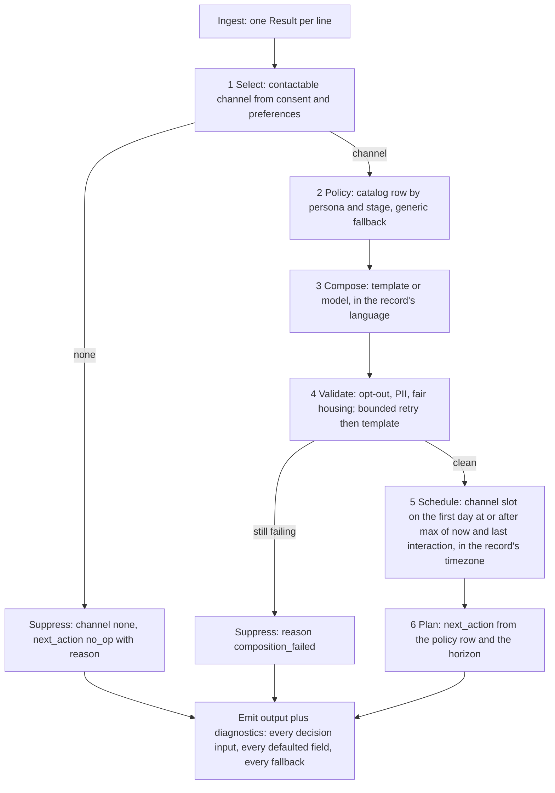

# Next-Best-Message Agent: design

Rewritten 2026-09-07 from playbook Phase 0 step 1, after the hold-out retrospective. The two
records in `sample.jsonl` are the only evidence any rule below is fitted to. The twelve-record
file `holdout_12.jsonl` is an evaluation set: it is run and reported, never fitted to
(decision D9 in [DECISION_LOG.md](DECISION_LOG.md)). Decisions are one paragraph each in the
decision log; this document holds the problem, the inputs, the rules with their evidence, the
architecture, the evaluation contract, and the numbered assumptions the log cites.

## 1. Problem

**Restatement (step 1).** Given a JSONL file where each line describes one person (a prospect
or a resident of an apartment property), their consent per channel, their ordered channel
preferences, context such as property, dates, timezone, language and stated interests, and the
constraints and thresholds the message must satisfy, produce for each line one `next_message`
(channel, send time, subject, body, call to action, or nothing) and one `next_action` (what the
system does next). The program learns what to do only from the fields of each record. A
labeled `expected` object on a line is the answer key for scoring and is never read to decide.

**Requirements: the verbs of the problem statement (step 2).**

| Verb in the statement | Requirement | Where it lives |
|---|---|---|
| reads the input record | one typed record per line, a bad line is one error row, never a crash | `Ingest/` |
| decides if it should communicate | consent and preferences decide contactability | `Decisions/` |
| decides how to communicate | channel, send time | `Decisions/` |
| decides what to say | subject, body, call to action, in the record's language | `Composition/`, `Safety/` |
| produces output that semantically matches the expected result | one output object per line, scored by the evaluator | `Evaluation/`, `Agent.Cli` |
| learns what to do only from input data | every rule keys on a named input field; no rule keys on an identifier | this document, section 3 |

**Success criterion (step 3).** The statement's own sentence: the output "semantically
matches the expected result." Fields whose vocabulary the input supplies (channel from
`channel_preferences`, the call-to-action type from `constraints.primary_cta`, the language from
`input.language`) are scored exactly. Fields whose vocabulary the input does not supply
(`next_action.type`, the body) are scored semantically, by a deterministic proxy first and a
pinned model judge second (section 6). The number reported is the honest one on the set the
rules were not fitted to.

## 2. Inputs

Inventory of every field in the two samples (step 4). "Required" means a decision cannot be
made without it; presence in both samples is not evidence of requirement, and absence from
both is not evidence a field cannot appear. Class (step 5): R the system reads, C a constraint
it must satisfy, T a threshold it is measured against, O an oracle it must never read to decide.

| Field | Type | Sample 1 | Sample 2 | Required | Class |
|---|---|---|---|---|---|
| `task_id` | string | yes | yes | yes, identity of the row | R |
| `persona` | string | prospect | prospect | no, unknown value uses the generic policy (A8) | R |
| `lifecycle_stage` | string | new | open | no, same | R |
| `consent.email_opt_in`, `sms_opt_in`, `voice_opt_in` | bool | yes | yes | yes, contactability needs them | R |
| `channel_preferences` | ordered list of channel names | [sms, email] | [email, sms] | yes, channel needs it; unknown names are skipped and reported (A3) | R |
| `input.property_name` | string | yes | yes | no, absent means no property fact in the body | R |
| `input.move_date_target` | date | 2026-01-10 | 2026-02-15 | no, absent means unknown horizon (A7) | R |
| `input.last_interaction` | timestamp with offset | yes | yes | no, absent means the reference time alone sets the day (A4) | R |
| `input.timezone` | IANA id | America/Chicago | America/Chicago | no, absent or unknown means UTC and a diagnostic (A6) | R |
| `input.language` | language tag | en | en | no, absent means en and a diagnostic (A13) | R |
| `input.profile.first_name` | string | Taylor | Taylor | no, absent means no name in the greeting | R |
| `input.profile.city_interest` | string | yes | absent | no | R |
| `input.profile.amenity_interest` | list of strings | absent | [pool, fitness] | no | R |
| any other member, at any depth | unknown | none seen | none seen | no; kept, listed in diagnostics, logged per record, never an error (A16) | R |
| `assertions.required_states` | list of state names | 3 | 3 | no; each is earned or reported as not earned (A14) | C |
| `assertions.constraints.no_pii_leak` | bool | true | true | no, absent means not required | C |
| `assertions.constraints.no_sensitive_discrimination` | bool | true | absent | no, same | C |
| `assertions.constraints.include_opt_out_instructions` | bool | true | true | no, same | C |
| `assertions.constraints.primary_cta` | string | book_tour | book_tour | no, absent means the generic call to action (A9) | C |
| `thresholds.p95_latency_ms` | int | 2000 | 2000 | no, absent means not measured | T |
| `thresholds.personalization_score_min` | number | 0.85 | 0.8 | no, same | T |
| `thresholds.reply_classification_f1_min` | number | 0.9 | 0.9 | no; no classifier exists, reported as not measured (A15) | T |
| `thresholds.safety_violations_max` | int | 0 | 0 | no, absent means 0 | T |
| `expected.next_message`, `expected.next_action` | objects | yes | yes | no; a line without them is unscoreable, not an error | O |

Output object, per line, always both members:

```json
{
  "next_message": { "channel": "sms | email | voice | none", "send_at": "ISO-8601 with local offset, or null",
                    "subject": "string or null", "body": "string or null",
                    "cta": { "type": "string", "options": ["..."], "link": "https://..." } },
  "next_action":  { "type": "string", "name": "...", "value": 3, "reason": "..." }
}
```

## 3. Rules and their evidence (step 6)

The two samples differ on: the second channel preference order, sms consent, the move date
(33 versus 68 days after the reference date), the stated interest (city versus amenities),
the chosen channel, the subject (null versus present), the call-to-action payload (options
versus link), the send hour, and the next action. Each rule below names the field it keys on,
its application to both samples, and every other field that would reproduce the same two
values (the confound). Ids and names are labels, not evidence.

| Decision | Rule (keyed on) | Sample 1 | Sample 2 | Confound or gap, and the assumption |
|---|---|---|---|---|
| Communicate | at least one preferred channel is opted in (`consent`, `channel_preferences`) | sms and email on: yes | email on: yes | no negative sample; suppression shape is A2 |
| Channel | first entry of `channel_preferences` that is opted in | [sms, email], sms on: sms | [email, sms], sms off: email | "sms when consented, else email" fits both too; A3 picks preference order because the list is ordered |
| Send day | first day at or after max(reference time, `last_interaction`) in `input.timezone` | last 12-08 09:04 local, ref 12-09: 12-09 | last 12-06 05:30 local, ref 12-09: 12-09 | "last_interaction plus N" needs N=1 and N=3, two constants for two rows; the reference time is A4 |
| Send hour | by channel: sms 09:00, email 10:00 local | 09:00 | 10:00 | voice unseen; minutes unseen; A5 |
| Subject | email only | null | present | A11 |
| Body facts | first name, property, stated interest, horizon cue, opt-out phrase for the channel | all present | all present | A12 |
| Call to action type | `constraints.primary_cta` through a vocabulary table | book_tour: schedule_tour | book_tour: schedule_tour | one pair observed; unknown values pass through, absent is generic (A9) |
| Call to action payload | sms carries numbered options in the body and `cta.options`; email carries `cta.link` | options | link | link value unseen beyond one host; A10 |
| Next action | horizon = `move_date_target` minus reference date; short: `start_cadence`; long: `follow_up_in_days` | 32 days: start_cadence | 68 days: follow_up_in_days 3 | threshold anywhere in (32, 68]; N seen once; absent date; A7 |
| Unknown persona or stage | generic policy: the rule above with the long-horizon branch, diagnostics name the fallback | n/a | n/a | A8 |
| Language | body in `input.language`; a language with no template goes to the model composer, or English with a diagnostic in template mode | en | en | A13 |
| Required states | earned by the step that proves them, recorded in diagnostics; unknown names are reported as not earned | 3 named | 3 named | A14 |

## 4. What the examples cannot tell (step 7) and what was asked (step 8)

Risk register. Each item becomes at least one record in the synthetic set (D6) before it
becomes a branch in code.

1. A record with no consented channel. 2. A persona or stage the samples never named.
3. A record with no move date, or a different date field (lease end, move in, a missed
appointment). 4. A language other than English. 5. A constraint, threshold, or required state
the samples never named, and an absent `primary_cta`. 6. Members at any depth the samples never
showed. 7. A `next_message` spelled with channel `none` and null fields. 8. A timezone the
runtime does not know, and a send slot across a daylight-saving transition. 9. A batch with no
`last_interaction` anywhere, so no field states the reference date. 10. A malformed line
between good lines. 11. A call-to-action vocabulary the samples never showed. 12. A past move
date.

Questions put to the requester on 2026-09-07 and the answers, recorded either way:

- Are rules fitted to the twelve-record file allowed? No. The twelve are unknown to the
  design; the program is built from the two-record file and must be bulletproof for future
  sets that may be harder. (D9)
- Where does the twelve-record file live? In the repo, beside `sample.jsonl`, linked into the
  test output like the sample. (D11)
- How does a run learn its reference time, since no field states the oracle's date? A `--now`
  flag; default is the current UTC time; the documented run against the twelve passes the date
  and says so. (D10)
- Does Phase 0 restart at step 1? Yes; this document is that restart. (D12)
- What is the action-type vocabulary beyond the two samples? No answer available; the catalog
  ships with what the samples show plus `no_op`, and the evaluator scores the rest
  semantically. (A8)
- What are the send minutes and per-stage send days? No answer; not modeled (A5).

## 5. Architecture

The four starting decisions of `~/.agent-rules/ARCHITECTURE.md` stay on their defaults
(decision log S1 to S4): one command-line tool over one library; code owns every decision and a
model writes prose only, choosing the call-to-action type from a code-owned catalog under
constrained decoding; seams exist only at the composer, the completion client, and the safety
validator, each with a real and an offline implementation, and time is a value passed in;
evaluation is part of the deliverable and is built and proven before the product.



| Component | Responsibility | Seam |
|---|---|---|
| `JsonlRecordReader` | one `Result<ProspectCase>` per line; unknown members retained | none |
| `ChannelSelector` | contactable channel or none, from consent and preferences | none |
| `PolicyCatalog` | one data file: action templates and call-to-action vocabulary keyed on persona and stage, with the generic row | none |
| `TemplateMessageComposer`, `OpenAiMessageComposer` | subject, body, call to action | `IMessageComposer` (real plus offline) |
| `OpenAiCompletionClient` | the only network call, structured output | `ICompletionClient` (real plus fake) |
| `SafetyValidator` | opt-out presence, PII, fair-housing terms; violations by category | `ISafetyValidator` (real plus fixed) |
| `SendScheduler` | `send_at` from the reference time, `last_interaction`, timezone, channel | none; time is a parameter |
| `NextActionPlanner` | `next_action` from the policy row and the horizon; `Result` when no rule applies | none |
| `LeasingMessageAgent` | the six numbered steps above, one comment each | none |
| `Evaluator` | the scorecard of section 6 | none |
| `CliRunner` | `--input`, `--output`, `--now`, `--composer`, `--diagnostics`, `--eval-report`, `--log-file`; exit 0, 1, 2 | none |

## 6. Evaluation

Built before the product changes and proven able to fail: the labeled answers passed as actuals
score 100 percent, and one corrupted field scores a failure (playbook step 33). Scored per
record: channel exact, with the agent's null message, the oracle's channel `none`, and a null
channel treated as one value; `send_at` to the day and to the hour; `next_action.type` exact
against the catalog, then semantic (a pinned model judge with a fixed rubric, one signal beside
the deterministic checks, off by default); call-to-action type exact against the mapped
constraint; call-to-action payload presence by channel; opt-out phrase; body language equals
`input.language`; safety violations within budget; personalization as fact coverage over the
facts the record carries; latency per record, p95 over the batch. Two sets, both reported and
labeled: `holdout_12.jsonl`, never fitted to, and a synthetic set written from section 4 before
any decision code changes and never edited after. Replay mode re-scores an existing output
file without re-running the agent.

## 7. Assumptions log

Every rule in section 3 cites one of these. Evidence names the input field, the sample, or the
absence that forces the assumption; "configurable" follows playbook step 41: a value is a
constant until a second known value earns a setting.

| # | Assumption | Evidence | Configurable |
|---|---|---|---|
| A1 | Contactable when any preferred channel is opted in | both samples contactable; sample 2 with sms off chose email | no |
| A2 | Suppression emits `next_message` with channel `none` and null fields, and `next_action` `no_op` with a reason | no negative sample; the statement says a message may be "not sent"; the output object must always have both members | no |
| A3 | Channel is the first opted-in entry of `channel_preferences`; unknown channel names are skipped and reported | sample 1 and 2 as in section 3; the list is ordered by name | no |
| A4 | Send day is the first day at or after max(reference time, `last_interaction`) in the record's timezone; reference time comes from `--now`, default current UTC time | sample 2's date is three days after its last interaction and sample 1's is one day after, so a time outside the record sets the day; answer from the requester, D10 | the flag only |
| A5 | Send hour by channel: sms 09:00, email 10:00, voice 09:00 local; no minutes | sample 1 09:00 sms, sample 2 10:00 email; voice and minutes unseen | no |
| A6 | Unknown or absent timezone resolves as UTC with a diagnostic | both samples America/Chicago; the field is a free string | no |
| A7 | Horizon = `move_date_target` minus the reference date; at most 45 days is short (`start_cadence`), else long (`follow_up_in_days` 3); absent date is long | 32 days gave `start_cadence`, 68 gave `follow_up_in_days` 3; 45 falls inside the open interval (32, 68]; it is not the midpoint (50), just a round number in range; absent is unseen | no |
| A8 | Unknown persona or stage uses the generic row: A7's rule, diagnostics name the fallback; the catalog names `start_cadence`, `follow_up_in_days`, `no_op` | both samples are prospects at `new` and `open`; other values are unseen | the catalog file |
| A9 | Call-to-action type: `primary_cta` through the vocabulary table (`book_tour` to `schedule_tour`); unknown values pass through unchanged with a diagnostic; absent gives the generic `reply` | one pair in both samples; absence unseen | the catalog file |
| A10 | sms carries numbered reply options in the body and `cta.options`; email carries `cta.link` built as `https://{property slug}.example/{cta path}` | sample 1 options Thu, Fri; sample 2 link `https://oakridge.example/tour` from Oak Ridge Apartments | no |
| A11 | Subject on email only | sample 1 null on sms, sample 2 present on email | no |
| A12 | Body carries first name, property, stated interest when present, horizon cue when a date exists, and the channel's opt-out phrase | both samples carry each element | no |
| A13 | Body language is `input.language`; the template set ships English; another language goes to the model composer, or English with diagnostic `locale_not_applied` in template mode | both samples en; the field exists, so other values must not fail | no |
| A14 | Required states are earned by the step that proves them and recorded in diagnostics; an unknown state name is recorded as not earned, never claimed | three names in both samples; the list is free text | no |
| A15 | `p95_latency_ms` is a percentile over the batch; `personalization_score_min` is fact coverage; `reply_classification_f1_min` and any unknown threshold are reported as not measured | four names in both samples; no classifier is in scope | no |
| A16 | Unknown members at any depth are kept, listed in diagnostics, logged per record, never an error | none seen; the statement promises more cases than the samples show | no |
| A17 | Required members are `task_id`, `consent`, `channel_preferences`; a line missing one is an error row naming it; every other member is optional with its default named in diagnostics | section 2; no decision can be made without these three | no |
| A18 | The model writes prose only and picks the call-to-action type from the catalog under constrained decoding; the template composer is the offline path and the fallback | the statement asks for an autonomous agent, not a model; decision S2 | no |
| A19 | The twelve-record file is an evaluation set; no rule or constant is fitted to it | requester's answer, D9 | no |

## 8. Non-goals, quality bar, security

Non-goals: transmitting messages; training models; a user interface; a reply classifier;
per-stage send minutes. Quality bar, self-imposed: strict TDD with the 100 percent gate,
mutation checks on every decision rule, the narration rehearsal before merge, and the honest
number on the unfitted sets reported beside the fitted one. Security: the OpenAI key lives in
`dotnet user-secrets`, scoped to chat completions, never handled by an agent; pricing and
eligibility are never free text; the validator runs on every exit.

## 9. Plan

Each sprint cites decisions in the log; one PR per sprint against `dev`.

| Sprint | Implements | Proof |
|---|---|---|
| 1 Decisions and gates | this document, the decision log, `holdout_12.jsonl`, CI, branch protection (S1 to S4, D8 to D12) | Phase 0 check: section 7 has no blank evidence cell; Phase 1 check: the `test` check green on the PR |
| 2 Harness | evaluator on every field of section 6, scorer proof, synthetic set from section 4, replay mode (D6) | scorer scores the labels at 100 percent and a corrupted field below; baseline numbers for both sets recorded |
| 3 Contracts | optional members, unknown members retained and logged, per-record diagnostics, `--now`, suppression shape (D1, D3, D10) | every section 4 record parses to one row; diagnostics name every defaulted field |
| 4 Decision core | catalog, generic fallback, plan after consent, `Result` from the planner (D2) | synthetic set through the core with the composer stubbed; diagnostics explain every decision |
| 5 Scheduling | reference time, floor, timezone and DST property tests (D4); repoint the `SendScheduler` comment from "assumptions log #2" to A4 and A5 | property tests green; unknown timezone is a row, not an exit |
| 6 Composition | facts, language handling, catalog-driven call to action, model prompt inputs, judge (D5) | both sets compose on the offline path with the network disabled |
| 7 Safety and states | earned states, violations by category, false-positive tests (D3) | every validator has a passing, a failing, and a false-positive test |
| 8 Structure and narration | interface removal, orchestrator steps, `docs/NARRATION.md`, final numbers (D7); repoint the `LeasingMessageAgent` comment that cites "section 4" to section 5 | narration delivered without notes; both numbers in the README |
