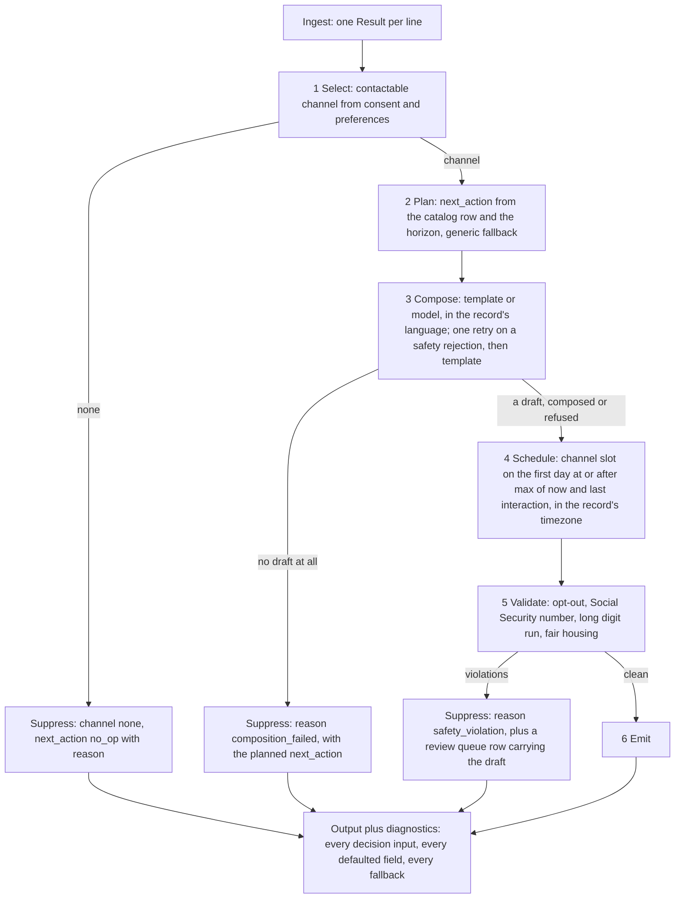

# Next-Best-Message Agent: design

Rewritten 2026-09-07 from playbook Phase 0 step 1, after the hold-out retrospective. The two
records in `sample.jsonl` are the only evidence any rule below is fitted to. The twelve-record
file `holdout_12.jsonl` is an evaluation set: it is run and reported, never fitted to
(decision D9 in [DECISIONS_ARCHIVE.md](DECISIONS_ARCHIVE.md)). Decisions are one paragraph each
in the archive; this document holds the problem, the inputs, the rules with their evidence, the
architecture, the evaluation contract, and the numbered assumptions the archive cites.

## 1. Problem

**Restatement (step 1).** Given a JSONL file where each line describes one person (a prospect
or a resident of an apartment property), their consent per channel, their ordered channel
preferences, context such as property, dates, timezone, language and stated interests, and the
constraints and thresholds the message must satisfy, produce for each line one `next_message`
(channel, send time, subject, body, call to action, or nothing) and one `next_action` (what the
system does next). The program learns what to do only from the fields of each record. A
labeled `expected` object on a line is the answer key for scoring and is never read to decide.

**Requirements: the verbs of the problem statement (step 2).**

| Verb in the statement | Requirement | Where it lives |
|---|---|---|
| reads the input record | one typed record per line, a bad line is one error row, never a crash | `Ingest/` |
| decides if it should communicate | consent and preferences decide contactability | `Decisions/` |
| decides how to communicate | channel, send time | `Decisions/` |
| decides what to say | subject, body, call to action, in the record's language | `Composition/`, `Safety/` |
| produces output that semantically matches the expected result | one output object per line, scored by the evaluator | `Evaluation/`, `Agent.Cli` |
| learns what to do only from input data | every rule keys on a named input field; no rule keys on an identifier | this document, section 3 |

**Success criterion (step 3).** The statement's own sentence: the output "semantically
matches the expected result." Fields whose vocabulary the input supplies (channel from
`channel_preferences`, the call-to-action type from `constraints.primary_cta`, the language from
`input.language`) are scored exactly. Fields whose vocabulary the input does not supply
(`next_action.type`, the body) are scored semantically, by a deterministic proxy first and a
pinned model judge second (section 6). The number reported is the honest one on the set the
rules were not fitted to.

## 2. Inputs

Inventory of every field in the two samples (step 4). "Required" means a decision cannot be
made without it; presence in both samples is not evidence of requirement, and absence from
both is not evidence a field cannot appear. Class (step 5): R the system reads, C a constraint
it must satisfy, T a threshold it is measured against, O an oracle it must never read to decide.

| Field | Type | Sample 1 | Sample 2 | Required | Class |
|---|---|---|---|---|---|
| `task_id` | string | yes | yes | yes, identity of the row | R |
| `persona` | string | prospect | prospect | no, unknown value uses the generic policy (A8) | R |
| `lifecycle_stage` | string | new | open | no, same | R |
| `consent.email_opt_in`, `sms_opt_in`, `voice_opt_in` | bool | yes | yes | yes, contactability needs them | R |
| `channel_preferences` | ordered list of channel names | [sms, email] | [email, sms] | yes, channel needs it; unknown names are skipped and reported (A3) | R |
| `input.property_name` | string | yes | yes | no, absent means no property fact in the body | R |
| `input.move_date_target` | date | 2026-01-10 | 2026-02-15 | no, absent means unknown horizon (A7) | R |
| `input.last_interaction` | timestamp with offset | yes | yes | no, absent means the reference time alone sets the day (A4) | R |
| `input.timezone` | IANA id | America/Chicago | America/Chicago | no, absent or unknown means UTC and a diagnostic (A6) | R |
| `input.language` | language tag | en | en | no, absent means en and a diagnostic (A13) | R |
| `input.profile.first_name` | string | Taylor | Taylor | no, absent means no name in the greeting | R |
| `input.profile.city_interest` | string | yes | absent | no | R |
| `input.profile.amenity_interest` | list of strings | absent | [pool, fitness] | no | R |
| any other member, at any depth | unknown | none seen | none seen | no; kept, listed in diagnostics, logged per record, never an error (A16) | R |
| `assertions.required_states` | list of state names | 3 | 3 | no; each is earned or reported as not earned (A14) | C |
| `assertions.constraints.no_pii_leak` | bool | true | true | no, absent means not required | C |
| `assertions.constraints.no_sensitive_discrimination` | bool | true | absent | no, same | C |
| `assertions.constraints.include_opt_out_instructions` | bool | true | true | no, same | C |
| `assertions.constraints.primary_cta` | string | book_tour | book_tour | no, absent means the generic call to action (A9) | C |
| `thresholds.p95_latency_ms` | int | 2000 | 2000 | no, absent means not measured | T |
| `thresholds.personalization_score_min` | number | 0.85 | 0.8 | no, same | T |
| `thresholds.reply_classification_f1_min` | number | 0.9 | 0.9 | no; no classifier exists, reported as not measured (A15) | T |
| `thresholds.safety_violations_max` | int | 0 | 0 | no, absent means 0 | T |
| `expected.next_message`, `expected.next_action` | objects | yes | yes | no; a line without them is unscoreable, not an error | O |

Output object, per line, always both members:

```json
{
  "next_message": { "channel": "sms | email | voice | none", "send_at": "ISO-8601 with local offset, or null",
                    "subject": "string or null", "body": "string or null",
                    "cta": { "type": "string", "options": ["..."], "link": "https://..." } },
  "next_action":  { "type": "string", "name": "...", "value": 3, "reason": "..." }
}
```

## 3. Rules and their evidence (step 6)

The two samples differ on: the second channel preference order, sms consent, the move date
(33 versus 68 days after the reference date), the stated interest (city versus amenities),
the chosen channel, the subject (null versus present), the call-to-action payload (options
versus link), the send hour, and the next action. Each rule below names the field it keys on,
its application to both samples, and every other field that would reproduce the same two
values (the confound). Ids and names are labels, not evidence. The last column also names the
decision paragraphs in [DECISIONS_ARCHIVE.md](DECISIONS_ARCHIVE.md) that took the rule.

| Decision | Rule (keyed on) | Sample 1 | Sample 2 | Confound or gap, the assumption, the decision |
|---|---|---|---|---|
| Communicate | at least one preferred channel is opted in (`consent`, `channel_preferences`) | sms and email on: yes | email on: yes | no negative sample; suppression shape is A2; D2, D57 |
| Channel | first entry of `channel_preferences` that is opted in | [sms, email], sms on: sms | [email, sms], sms off: email | "sms when consented, else email" fits both too; A3 picks preference order because the list is ordered; D57 |
| Send day | the slot table's row for `persona`, `lifecycle_stage` and channel moves the send that many local days past the floor's day, the floor being max(reference time, `last_interaction`) in `input.timezone`; with no row, the floor's day | last 12-08 09:04 local, ref 12-09: 12-09 | last 12-06 05:30 local, ref 12-09: 12-09 | nine hold-out records set nine rows, one each, since D81 made the hold-out training data; each also fits an offset from a date field the record carries, and the floor-relative rule needs no new member; A4, A5; D4, D10, D82 |
| Send hour | the same row's local time, to the minute; with no row, by channel: sms 09:00, email 10:00 local | 09:00 | 10:00 | two stage pairs fit a row keyed on the channel and one keyed on having no `last_interaction` equally, and the channel key is a stated choice, not a learned rule (the open question of 2026-09-10 in the archive); the hour check compares the hour only; A5; D4, D82 |
| Send slot on a transition day | a slot the zone springs forward across resolves past the gap; one it falls back across resolves to the earlier of its two instants; `schedule.slot` in the diagnostics names which | both samples exact | both samples exact | no zone in the current database transitions across 09:00 or 10:00, so neither branch is reachable from the data; A20, D21 |
| Subject | email only | null | present | A11; D42's third brand rule checks it |
| Body facts | first name, property, stated interest, horizon cue, opt-out phrase for the channel; on the model path, code appends the record's language set's opt-out sentence when the draft carries none | all present | all present | A12; D5, D13 a, D72 |
| Call to action type | `constraints.primary_cta` through a vocabulary table, on both composers; absent, the persona and stage's default where one exists, else the generic `reply`; the model's response schema allows only the type the table resolves | book_tour: schedule_tour | book_tour: schedule_tour | the hold-out adds `reschedule_tour` to `reschedule`, `reply_intent` to `intent_capture`, and two stage defaults, one record each; unknown values pass through (A9); D5, D73, D82 |
| Call to action payload | sms carries numbered options in the body and `cta.options`; email carries `cta.link`, built from the property slug and the catalog's path | options | link | link value unseen beyond one host; A10, A21, D25 |
| Next action | horizon = `move_date_target` minus reference date picks the branch (short or long); the branch reads the catalog row for `persona` and `lifecycle_stage` | prospect/new, 32 days: start_cadence | prospect/open, 68 days: follow_up_in_days 3 | threshold anywhere in (32, 68]; the hold-out adds seven rows and prospect/new's long branch, each from one record with no move date, so each states its long branch only; the action check compares the type only; A7, A8; D2, D17, D18, D82 |
| Unknown persona or stage, or a branch no row states | the generic row, and `action_plan.source` in the diagnostics names which of the two fallbacks fired | prospect/new states both branches | prospect/open states no short branch | the generic row is the same for every persona, so a resident on a short horizon at a stage with only a long branch gets the prospect welcome cadence; A8; D2, D17, D83 |
| Language | body in `input.language`, with no allowlist anywhere; the offline composer holds a template set per language it can serve, English and Spanish, and any other tag is served in English with `locale_applied` false; the model path passes the tag through | en | en | A13, D26 |
| Required states | earned by the step that proves them, recorded in diagnostics; unknown names are reported as not earned | 3 named | 3 named | A14; D42, D57 |

## 4. What the examples cannot tell (step 7) and what was asked (step 8)

Risk register. Each item becomes at least one record in the synthetic set (D6) before it
becomes a branch in code. That set is `synthetic_12.jsonl`: one record per item, two for
item 8 (an unknown timezone, and a send slot across the daylight-saving transition), one
malformed line for item 10, labels written from the assumptions of section 7, run with
`--now 2026-03-07T12:00:00Z`, frozen since 2026-09-08.

1. A record with no consented channel. 2. A persona or stage the samples never named.
3. A record with no move date, or a different date field (lease end, move in, a missed
appointment). 4. A language other than English. 5. A constraint, threshold, or required state
the samples never named, and an absent `primary_cta`. 6. Members at any depth the samples never
showed. 7. A `next_message` spelled with channel `none` and null fields. 8. A timezone the
runtime does not know, and a send slot across a daylight-saving transition. 9. A batch with no
`last_interaction` anywhere, so no field states the reference date. 10. A malformed line
between good lines. 11. A call-to-action vocabulary the samples never showed. 12. A past move
date.

Questions put to the requester on 2026-09-07 and the answers, recorded either way:

- Are rules fitted to the twelve-record file allowed? No. The twelve are unknown to the
  design; the program is built from the two-record file and must be bulletproof for future
  sets that may be harder. (D9)
- Where does the twelve-record file live? In the repo, beside `sample.jsonl`, linked into the
  test output like the sample. (D11)
- How does a run learn its reference time, since no field states the oracle's date? A `--now`
  flag; default is the current UTC time; the documented run against the twelve passes the date
  and says so. (D10)
- Does Phase 0 restart at step 1? Yes; this document is that restart. (D12)
- What is the action-type vocabulary beyond the two samples? No answer available; the catalog
  ships with what the samples show plus `no_op`, and the evaluator scores the rest
  semantically. (A8)
- What are the send minutes and per-stage send days? Not answered by the samples; since D81
  the hold-out is training data, and D82 fits one slot row per stage it shows (A5).

**Open questions the data could not answer (step 91).** Each is open after Phase 7, with the
measurement that shows it is open and the assumption that stands in for an answer.

1. The oracle's send days, hours and minutes per stage, and the voice hour. The hold-out reads
   `Day 7/11, Hour 5/11` under the template (`tests/Agent.Tests/Evaluation/BaselineNumbersTests.cs`,
   line 27); the two samples fix only the hour by channel (A4, A5).
2. The next-action vocabulary beyond the two samples. The hold-out reads `Action 7/12` (same
   line); every miss is a type the samples never showed (A8).
3. The call-to-action vocabulary beyond `book_tour`. The hold-out reads `CTA 7/11` (same line)
   (A9).
4. Where in (32, 68] days the horizon threshold sits. Two samples bound it and nothing places it;
   45 is a round number in range (`src/Agent/Decisions/NextActionPlanner.cs`, line 10; A7).
5. Whether the model writes better messages than the template. After D72 and D73 both read
   `Overall: 12/13 passed` on the synthetic set (`docs/scorecards/synthetic_12_template.txt`,
   `docs/scorecards/synthetic_12_openai_after_d72_run1.txt` to `_run3.txt`), and no deterministic
   check rewards the model's prose. The judge is the check that could, and it read `ActionSem 0/0,
   BodySem 0/0` on every committed scorecard, because no Phase 7 run passed `--judge` (D70).
6. Whether a live model can meet the records' own `p95_latency_ms` of 2000 ms. The one run bounded
   by it after D33, D35 and D37 had the model write 2 of 10 messages at p95 2066 ms, FAIL
   (`docs/scorecards/synthetic_12_openai_no_flag_after_d35.txt`); D36 is closed for evaluation
   runs only (A22).
7. The vendor's rate limit for concurrent calls, against which four records in flight is an
   unmeasured margin (A23).
8. What earns `renewal_offer_loaded`, which three hold-out records assert and no check defines;
   a rule for it would be fitted to the hold-out (A14, A19).
9. How the vendor retains a request the client abandoned at its timeout; the vendor's page does
   not say (section 8, D44).

### The frozen set, `synthetic_v2.jsonl` (D81)

Written 2026-09-10 by an agent that read only `problem_statement.txt` and `sample.jsonl`, never
the code, the tests, the docs or either earlier set, and labeled before any rule fitted to the
hold-out landed. It is run with `--now 2026-10-24T22:00:00Z`, a Saturday: 17:00 in Chicago and
the evening before London falls back. 29 labeled records and one malformed line, line 15. It
carries the honest number from D81 on; `holdout_12.jsonl` is training data from the same day.

The problem statement names no channel, time, consent, horizon, locale or stage, so almost every
label is the author's domain judgment, and several disagree on purpose with this program's own
assumptions: the short horizon is at most 60 days where A7 says 45, an unknown timezone is
inferred from the city where A6 says UTC, and the follow-up gaps are 2, 3 and 7 days. A miss on
one of those is a disagreement with a stated assumption, not a defect, and no rule is fitted to
this set to remove it. Where the evidence does not decide, the author's choice is named below.

| Record | Covers | Label and its basis |
|---|---|---|
| `v2_prospect_new_short_sms` | prospect, new; sms | SMS 09:00, the short welcome cadence; sample 1's shape |
| `v2_prospect_new_long_email` | prospect, new, long horizon; email | email 10:00 since sms is not consented, a long welcome cadence; sample 2's pattern, the cadence name judged |
| `v2_horizon_boundary_60_days` | move date exactly 60 days out | short, day 60 inclusive; the samples bound the cutoff in (32, 68], the 60 judged |
| `v2_horizon_boundary_61_days` | move date 61 days out | long; the other side of the same boundary |
| `v2_move_date_in_past` | a past move date; prospect, open | sent, asks for a new timeline, follow up in 2; a stale date is not a closed search, judged |
| `v2_prospect_toured` | prospect, toured | SMS thanks, call to action `start_application`; judged |
| `v2_prospect_applied` | prospect, applied | email to the applicant portal with no application detail, per `no_pii_leak`; judged |
| `v2_prospect_approved` | prospect, approved | SMS approval, call to action `sign_lease`; judged |
| `v2_prospect_lost` | prospect, lost; a no case | suppressed, `no_op` reason `lead_closed`; the statement's "or not sent", judged |
| `v2_resident_move_in` | resident, move in | SMS key pickup, a move-in cadence; judged |
| `v2_resident_active_checkin` | resident, active; `America/Phoenix`, no daylight saving | email check-in with a maintenance link, follow up in 7; judged |
| `v2_resident_renewal` | resident, renewal; no move date, a lease end date | email renewal offer about 90 days before lease end; judged |
| `v2_resident_notice_given` | resident, notice given | SMS to book the move-out inspection, follow up in 3; judged |
| `v2_voice_channel` | voice; prospect, open | voice 10:00 with a spoken opt-out; the sample consent carries `voice_opt_in`, the hour judged |
| `v2_spanish_locale` | Spanish | Spanish body keeping the STOP keyword; judged |
| `v2_vietnamese_locale` | a language with no prose set | Vietnamese body rather than an English fallback; judged |
| `v2_unknown_timezone` | `America/Dallas`, not a zone | sent in Central time inferred from the city; judged, against A6 |
| `v2_dst_fall_back_london` | a send across a transition | 10:00 at +00:00, the zone's offset after it falls back; judged |
| `v2_missing_move_date` | no move date | short cadence, asks when they plan to move; judged |
| `v2_missing_last_interaction` | no last interaction | sent, long horizon, follow up in 3; sample 2's pattern |
| `v2_missing_first_name` | no first name | "Hi there", otherwise the standard message; judged |
| `v2_missing_property_name` | no property name | email naming the city, reply options instead of a link; judged |
| `v2_missing_language` | no language | English; both samples are `en` |
| `v2_empty_channel_preferences` | empty preferences | email as the least intrusive consented channel; judged |
| `v2_empty_profile` | empty profile | generic greeting, still sent; judged |
| `v2_no_data_to_personalize` | no property, date, language or profile | a generic welcome, short cadence; judged |
| `v2_no_consent_for_preferred` | no consent for any channel | suppressed, `no_op` reason `no_consented_channel`; the samples assert `consent_verified` |
| `v2_consent_only_non_preferred` | consent only for a channel not preferred | sent by email: consent permits, preference only ranks; sample 2 falls back to the consented channel |
| `v2_unusual_persona_stage` | prospect, renewal | suppressed, `no_op` reason `persona_stage_mismatch`; judged |
| line 15 | malformed JSON | one error row while the rest run |

Three choices the author named as open: every send lands on the Sunday morning, where a next
business day rule would move all of them to Monday; "the next morning after now" and "three days
after the last interaction" both fit the samples, and the first is used; the Spanish and
Vietnamese bodies are not checked by a native speaker.

## 5. Architecture

The four starting decisions of `~/.agent-rules/ARCHITECTURE.md` stay on their defaults
(S1 to S4 in the archive): one command-line tool over one library; code owns every decision and a
model writes prose only, with code setting the call-to-action type, which the response schema
restricts to the one type the catalog resolves (D73), and appending the required opt-out sentence
when the model leaves it out (D72); seams exist only at the composer, the completion client, and the safety
validator, each with a real and an offline implementation, and time is a value passed in;
evaluation is part of the deliverable and is built and proven before the product.



| Component | Responsibility | Seam |
|---|---|---|
| `JsonlRecordReader` | one `Result<ProspectCase>` per line; unknown members retained | none |
| `ChannelSelector` | contactable channel or none, from consent and preferences | none |
| `ActionCatalog` | the action for a persona and lifecycle stage, one branch per horizon, compiled into one file with the generic row; `Create` is the gate every catalog goes through (D17, D18) | none |
| `TemplateMessageComposer`, `OpenAiMessageComposer` | subject, body, call to action, plus the notes saying which of them wrote it (D24); on the model path code sets the call-to-action type and appends a missing opt-out sentence (D72, D73) | `IMessageComposer` (real plus offline) |
| `ValidatingMessageComposer` | the compose-validate loop: validates every draft, retries only a safety rejection with its violations in the prompt, answers any other failure with the fallback composer at once, validates the fallback too, and carries a refused draft out rather than destroying it (D34, D48) | implements `IMessageComposer` and wraps two of them |
| `CallToActionCatalog`, `PropertyLink` | the call-to-action vocabulary and the email link (A9, A10, A21) | none |
| `MessageTemplates`, `MessageTemplateCatalog` | one prose set per language the offline composer can serve (A13, D26) | none |
| `OpenAiCompletionClient` | the only network call, on the official SDK, bounded and counted: the whole call budget to one attempt, a retry only on a transient status, never after a timeout (D27, D28, D33, D35; A22) | `ICompletionClient` (real plus fake) |
| `SemanticJudge` | the two semantic checks, off unless `--judge` (D30) | none; it takes the completion client |
| `SafetyValidator` | four checks answering for themselves: opt-out instructions, Social Security number, long digit run, fair-housing terms; violations by check (D38, D39) | `ISafetyValidator` (real plus fixed) |
| `BrandStyleValidator` | three brand rules, reported in the diagnostics and never a gate (D39, D42) | none; a static class |
| `SendScheduler` | `send_at` from the reference time, `last_interaction`, timezone, channel | none; time is a parameter |
| `NextActionPlanner` | `next_action` from the catalog row and the horizon, plus the branch, the horizon in days and which row answered; no `Result`, because the generic row makes every record classifiable (D18) | none |
| `LeasingMessageAgent` | the six numbered steps above, one comment each | none |
| `Evaluator` | the scorecard of section 6 | none |
| `CliRunner` | `--input`, `--output`, `--replay`, `--now`, `--composer`, `--model-call-budget-ms`, `--diagnostics`, `--eval-report`, `--judge`, `--review-queue`, `--log-file`; the one owner of the `TaskId` log scope (D16); up to four records at once, folded back in input order (D37); a line that did not parse or a record that threw is an `ERROR` row of the scorecard (D71); exit 0, 1, 2 | none |

**Interfaces (step 91).** Exactly three, the seams S3 names and D58 kept; `interface I` matches
these three files in `src/` and nothing else.

| Interface | Implementations in `src/` | Test substitutes |
|---|---|---|
| `IMessageComposer` (`src/Agent/Composition/IMessageComposer.cs`) | `OpenAiMessageComposer` (real), `TemplateMessageComposer` (offline, and the fallback), `ValidatingMessageComposer` (the compose-validate loop, which wraps an inner and a fallback composer) | `SequenceMessageComposer`, `ThrowsComposer`, `ThrowsOnCancellationComposer` in `tests/Agent.Tests/TestSupport/`; `ThrowingComposer`, `StaggeredComposer`, `CancelOnFirstComposeComposer`, `CancelsWhileComposingComposer` in `tests/Agent.Cli.Tests/TestSupport/` |
| `ICompletionClient` (`src/Agent/Composition/ICompletionClient.cs`) | `OpenAiCompletionClient` | `FakeCompletionClient` in `tests/Agent.Tests/TestSupport/`; `CostingCompletionClient`, `FixedJudgeCompletionClient` in `tests/Agent.Cli.Tests/TestSupport/` |
| `ISafetyValidator` (`src/Agent/Safety/ISafetyValidator.cs`) | `SafetyValidator` | `FixedSafetyValidator` in `tests/Agent.Tests/TestSupport/` |

## 6. Evaluation

Built before the product changes (Sprint 3, landed 2026-09-08) and proven able to fail: the
labels of every set passed as actuals score 100 percent, and one corrupted field per check
scores a failure on that check (playbook step 33; both proofs run in the suite,
`ScorerProofTests`). Every check returns one of three verdicts, passed, failed, or not
measured; a record passes when nothing failed, and not measured never counts as a pass in
the per-check numbers (A15). Scored per record, against the label: channel exact, with the
agent's null message, the oracle's channel `none`, and a null channel as one value; `send_at`
to the day and to the hour in the label's offset; `next_action.type` exact, and beside it the judge's own
verdict on the same field (the semantic judge landed in Sprint 6 under D30: a pinned model,
a pinned rubric, reference-based against the label, off unless `--judge` is passed, and
excluded from a record's pass or fail so it can never overturn a deterministic check); call-to-action type exact against the label's `cta.type` (D13 d);
call-to-action payload presence by channel, options on sms and a link on email; the opt-out
instruction by the one definition the validator enforces (D13 b); body language by a
stop-word detector for English and Spanish, not measured for any other stated language
(D13 c); safety violations within the stated budget, default zero; personalization as coverage
of the first name and the property name over subject plus body (D13 a). Latency is judged
once per batch, a nearest-rank p95 against the strictest stated budget, which stays the
records' own on a run where `--model-call-budget-ms` raises the call bound (D70). The scorecard prints
one row per record, a per-check line of passed over measured (the source of every number
in this document and the README), the p95 line, and the overall count. An input line that did
not parse, and a record that threw inside the agent, each get one `ERROR` row that counts in the
overall count and is measured on no check, so the synthetic set reads `Overall: 12/13 passed`
(D71; `docs/scorecards/synthetic_12_template.txt`). Three sets, all
reported and labeled: `sample.jsonl`, the fitting evidence; `holdout_12.jsonl`, never fitted
to; `synthetic_12.jsonl`, written from section 4 before any decision code changed and never
edited after. `--replay` re-scores an existing output file against its input without running
the agent (D14).

## 7. Assumptions log

Every rule in section 3 cites one of these. Evidence names the input field, the sample, or the
absence that forces the assumption; "configurable" follows playbook step 41: a value is a
constant until a second known value earns a setting.

| # | Assumption | Evidence | Configurable |
|---|---|---|---|
| A1 | Contactable when any preferred channel is opted in | both samples contactable; sample 2 with sms off chose email | no |
| A2 | Suppression emits `next_message` with channel `none` and null fields, and `next_action` `no_op` with a reason | no negative sample; the statement says a message may be "not sent"; the output object must always have both members | no |
| A3 | Channel is the first opted-in entry of `channel_preferences`; an unknown channel name parses as the `Unknown` value, which is never opted in, and the ingest notes name it | sample 1 and 2 as in section 3; the list is ordered by name | no |
| A4 | Send day is the first day at or after max(reference time, `last_interaction`) in the record's timezone; reference time comes from `--now`, default current UTC time | sample 2's date is three days after its last interaction and sample 1's is one day after, so a time outside the record sets the day; answer from the requester, D10 | the flag only |
| A5 | Send slot: the row for `persona`, `lifecycle_stage` and channel gives local days after the floor's day and a local time to the minute; with no row, the channel's hour on the floor day: sms 09:00, email 10:00, voice 09:00 local | samples 1 and 2 set the channel hours; nine hold-out records set nine rows, one each (D81, D82); two stage pairs fit a channel key and a no-`last_interaction` key equally, and the channel key is a stated choice (the open question of 2026-09-10 in the archive); voice unseen | the table, `src/Agent/Decisions/SendSlotTable.cs` |
| A6 | Unknown or absent timezone resolves as UTC with a diagnostic | both samples America/Chicago; the field is a free string. Phase 7 confirmed it on data: `synthetic_08_unknown_timezone` reads Day and Hour OK on every scorecard in `docs/scorecards/`, and FAULT_INJECTION.md section 4 (b) names the diagnostics and tests | no |
| A7 | Horizon = `move_date_target` minus the reference date; at most 45 days is short (`start_cadence`), else long (`follow_up_in_days` 3); an absent date is long (no date, no cadence to start); a past date is short (the move is due) | 32 days gave `start_cadence`, 68 gave `follow_up_in_days` 3; 45 falls inside the open interval (32, 68]; it is not the midpoint (50), just a round number in range; absent and past are unseen | no |
| A8 | Unknown persona or stage uses the generic row: A7's rule, diagnostics name the fallback. The catalog names `start_cadence`, `follow_up_in_days`, `no_op`, `reset_cadence`, `schedule_sms_reminder`, `branch_on_intent` and `start_esign_flow`. A row states only the horizon branch a labeled record showed, and the other falls to the generic row rather than to an invented value (A19) | the two samples set prospect/new short and prospect/open long; since D81 the hold-out sets prospect/new long and seven rows, each from one record with no move date; the generic row is the same for every persona | the catalog file, `src/Agent/Decisions/ActionCatalog.cs` (D17) |
| A9 | Call-to-action type: `primary_cta` through the vocabulary table (`book_tour` to `schedule_tour`); unknown values pass through unchanged with a diagnostic; absent gives the generic `reply`; the model path is held to the same type, which its response schema allows alone (D73); an absent `primary_cta` takes the persona and stage's default where one exists (`schedule_tour` for prospect/new, `review_renewal_details` for resident/renewal_details_requested, D82) | one pair in both samples; absence unseen. Phase 7 refuted leaving the type to the model when the record states none: `synthetic_05` reads CTA FAIL in `docs/scorecards/synthetic_12_openai_run1.txt` and `_run2.txt`, where the model chose `contact`, and OK in `_run3.txt` only because the template answered (VARIANCE.md, per-record table); after D73 it reads OK in all three `synthetic_12_openai_after_d72_run*.txt` | the catalog file |
| A10 | sms carries numbered reply options in the body and `cta.options`; email carries `cta.link` built as `https://{property slug}.example/{cta path}` | sample 1 options Thu, Fri; sample 2 link `https://oakridge.example/tour` from Oak Ridge Apartments | no |
| A11 | Subject on email only | sample 1 null on sms, sample 2 present on email | no |
| A12 | Body carries first name and property (the two facts the scorer counts, D13 a), stated interest when present, horizon cue when a date exists, and the channel's opt-out phrase; on the model path code appends the record's language set's opt-out sentence when the draft carries none (D72) | both samples carry name, property, and opt-out; sample 2 carries its amenities; sample 1's body omits its city, so stated interest is composed but not scored. Phase 7: left to the model, the opt-out was the one reason the safety gate refused drafts, 11, 10 and 12 a run, and none were refused after D72 (VARIANCE.md, both batch tables); OptOut reads 10/10 on every scorecard in `docs/scorecards/` | no |
| A13 | Body language is `input.language` and nothing gates on a language allowlist: the model path passes the tag through unchanged, and the template composer holds one set per language it can serve, English and Spanish, with any other tag served in English and the diagnostic `locale_not_applied` | both samples en; the synthetic set's item 4 record is es; the field is a free tag, so other values must not fail (D26). Phase 7 confirmed the pass-through on the model path: after D72 the model wrote `synthetic_04` on all three runs, with the Spanish set's opt-out sentence appended (VARIANCE.md, After D72 and D73), and Lang reads 10/10 on every scorecard in `docs/scorecards/` | the template sets |
| A14 | Required states are earned by the step that proves them and recorded in diagnostics; an unknown state name is recorded as not earned, never claimed | three names in both samples; the list is free text; the states map of D42 gives every name in a record's own `required_states` its verdict, `consent_verified` from step 1, the consent-driven channel selection, which owns the state and earns it for every record that reaches it, whatever it answers and whatever the record's `channel_preferences` list holds (D57), `fair_housing_check_passed` from the `FairHousing` check alone (D38), `brand_style_applied` from the brand-style validator, and every other name not earned by name; the hold-out's `renewal_offer_loaded` is such a name and stays not earned, because a rule for it would be fitted to the hold-out (D9, A19) | no |
| A15 | `p95_latency_ms` is a nearest-rank p95 over the batch against the strictest stated budget; `personalization_score_min` is fact coverage; a check with no stated threshold, no message to check, or no recorded value is not measured, never passed; `reply_classification_f1_min` and any unknown threshold are not measured | four names in both samples; no classifier is in scope. Phase 7: every model-path scorecard fails the p95 against 2000 ms, at 8043, 8261, 9356, 2318, 2398, 4508 and 2066 ms (`docs/scorecards/synthetic_12_openai_*.txt`), where the template's reads 19 ms OK (`synthetic_12_template.txt`) | no |
| A16 | Unknown members at any depth are kept, listed in diagnostics, logged per record, never an error | none seen; the statement promises more cases than the samples show | no |
| A17 | Required members are `task_id`, `consent`, `channel_preferences`; a line missing one is an error row naming it; every other member is optional with its default named in diagnostics; that line is also one `ERROR` row of the scorecard, counted in the overall count and measured on no check (D71) | section 2; no decision can be made without these three. Phase 7: `docs/scorecards/synthetic_12_template.txt` line 14 reads `ERROR: Line 11 failed to parse`, under `Overall: 12/13 passed`, which `tests/Agent.Tests/Evaluation/BaselineNumbersTests.cs` pins (line 33) | no |
| A18 | The model writes prose only; code sets the call-to-action type, which the response schema allows alone (D73), and appends the required opt-out sentence the model leaves out (D72); the template composer is the offline path and the fallback | the statement asks for an autonomous agent, not a model; decision S2. Phase 7 refuted the older form, in which the model picked the type and wrote the disclosure: across the first three live runs channel, send time, action type and payload matched the template's on every run, while `synthetic_05`'s type and 33 opt-out refusals moved with the model (VARIANCE.md); after D72 and D73 the model wrote all 10 messages at one call each on every run and the scored outcome stopped moving (VARIANCE.md, After D72 and D73) | no |
| A19 | `holdout_12.jsonl` was an evaluation set until 2026-09-10 and is training data from then; `synthetic_12.jsonl` is a regression set; `synthetic_v2.jsonl` is the evaluation set, and no rule or constant is fitted to it | requester's answer, D9; amended by D81 | no |
| A20 | The channel's slot on a day the zone springs forward across it resolves to the first instant that exists at or after the slot; a slot the zone falls back across, and so reaches twice, resolves to the earlier instant; the diagnostics name which happened | none: both samples are `America/Chicago` at 09:00 and 10:00, and no transition in the current zone database covers those hours, so the branch is unreachable from any observed record; stated over a zone's adjustment rules, proved against custom zones and a sweep of every system zone's transitions (D21) | no |
| A21 | The email link is `https://{slug}.example/{path}`: the slug is the property name lowercased with non-alphanumeric characters removed and a trailing property-type word dropped, and the path comes from the catalog's call-to-action column | sample 2's `https://oakridge.example/tour` from "Oak Ridge Apartments" and `book_tour`; one pair, so "the first two words concatenated" fits it equally and this picks the type-word rule because the other breaks on a one-word or four-word name (D25) | the catalog file |
| A22 | A model call is bounded by the strictest `p95_latency_ms` the batch states, given whole to one attempt, and a timeout is never retried (D28, D33, D35); `--model-call-budget-ms` replaces the bound for a run, and the p95 check keeps the records' own budget (D70) | added from Phase 7, which relied on it: with 1000 ms attempts the model wrote none of 23 messages (section 9, the step 60 run); with one 2000 ms attempt it wrote 2 of 10, 10 calls and 2 completed, p95 2066 ms (`docs/scorecards/synthetic_12_openai_no_flag_after_d35.txt`); with the flag at 30000 ms it wrote all 10 at 1.5 to 4.5 seconds a record (VARIANCE.md, After D72 and D73). On these sets the stated budget and a live model do not fit together, and D36 is closed for evaluation runs only | the flag, with `--composer openai` only (D70) |
| A23 | Four records in flight at once stay under the vendor's rate limit | added from Phase 7, which relied on it and did not measure it: D37 sets four as a margin under a limit this project has never measured (`src/Agent.Cli/CliRunner.cs`, `MaxConcurrentRecords`, line 54), and the one live run made under it, `docs/scorecards/synthetic_12_openai_no_flag_after_d35.txt`, ended 8 of its 10 calls at the timeout (VARIANCE.md) | no; a constant |
| A24 | `synthetic_v2.jsonl` stands for what the customer wants from records the samples never showed | written 2026-09-10 blind to the code, the docs and both earlier sets, from the problem statement and the two samples only; every label's basis is in section 4, and most are the author's judgment because the statement names no channel, time or stage (D81) | no |
| A25 | The day offset of a send slot read from a rules file is at most 365 | none from data: no labeled record sends more than five days after its floor, and the cap is a guard against date overflow in the scheduler, chosen by the agent that wrote the loader (D82) | the constant `MaxDaysAfterFloorDay` in `src/Agent/Decisions/SendSlotTable.cs` |

## 8. Non-goals, quality bar, security

Non-goals: transmitting messages; training models; a user interface; a reply classifier;
a quiet-hours window (`docs/CODE_REVIEW.md`). Quality bar, self-imposed: strict TDD with the 100 percent gate,
the narration rehearsal before merge, and the honest
number on the unfitted sets reported beside the fitted one. Security: the OpenAI key lives in
`dotnet user-secrets`, scoped to chat completions, never handled by an agent; pricing and
eligibility are never free text; the validator runs on every exit.

**Vendor data retention (step 69, D44).** One external service receives user data: OpenAI's
`/v1/chat/completions`, reached only when `--composer openai` or `--judge` is passed. Read
from the vendor's own platform data page, `developers.openai.com/api/docs/guides/your-data`,
on 2026-09-09. API data is not used to train or improve OpenAI models by default, the position
since 2023-03-01, and the exception is an explicit opt-in. Abuse-monitoring logs for this
endpoint are retained up to 30 days, unless longer retention is required by law or is
reasonably necessary to protect the service or a third party from harm; the stated purpose is
enforcing the usage policies and mitigating harmful uses. Application state is a separate axis
from abuse monitoring, and for this endpoint it is "None" apart from named exceptions, audio
outputs for one hour and prompt-cache tensors expiring within 24 hours; the 30-day
application-state default belongs to the Responses API, not to Chat Completions. Structured
Outputs has no separate retention rule. Two approval-gated controls exist: Modified Abuse
Monitoring excludes customer content from the abuse-monitoring logs, and Zero Data Retention
does the same and additionally forces `store` to false. Both require prior approval by OpenAI
and additional terms, are requested through OpenAI sales, and are configured under Settings,
Organization, Data controls, Data retention; `/v1/chat/completions` is on the ZDR-eligible
list.

Two things the reading did not settle, recorded as absence rather than filled in. The
documentation does not address a request the client abandons at its timeout while the server
completes it: the nearest published fact is that the abuse-monitoring log is generated for the
API feature usage, and nothing narrows or extends the 30-day window for a dropped connection.
That case is not hypothetical here, because D31 measured roughly a third of abandoned attempts
completing on the server after the client walked away. And no tier difference is verified:
`openai.com/enterprise-privacy` returned HTTP 403 and was not read, while the platform data
page draws no tier distinction of its own, its controls being per organization or project and
gated on approval rather than on purchase tier. Not verified is what is recorded here, not
that an enterprise or business tier retains the same way.

The judgment is D44's, and both halves of it are stated rather than the convenient one: the
default is acceptable for this project as it stands, and it is not acceptable for a production
deployment carrying real prospect data. The first half holds on what the prompt actually
contains, which is first name, property name, stated interest, persona, lifecycle stage,
language, and two dates. It carries no phone number, no email address, no unit number, no
renewal offer id, and no free-text note, and that is a property of `BuildUserPrompt` a golden
test already pins. The production path, if a real deployment sends real prospect data, is one
of the two approval-gated controls above.

## 9. Plan

Each sprint cites decisions in the archive; one PR per sprint against `dev`.

Phase record, from `~/.agent-rules/PROJECT_PLAYBOOK.md`. The live one is at the top of
[DECISION_LOG.md](DECISION_LOG.md); this is what has been passed and what passed it.

| Phase | Its check | Passed |
|---|---|---|
| 0 Intake | the design doc's assumptions log has an evidence column with no blanks | 2026-09-07, after restarting at step 1 the same day (D12) |
| 1 Environment and agent setup | a fresh clone builds and runs the empty test suite from one documented command | 2026-09-07, CI green on PR #16, with `dev` requiring the `test` check (D8) |
| 2 Scaffold and verification harness | the evaluator scores the golden expected outputs at 100 percent and a deliberately wrong output at less | 2026-09-08 in Sprint 3, both proofs in the suite (`ScorerProofTests`, D13) |
| 3 Deterministic core | the deterministic core passes the synthetic set with every fuzzy component stubbed, and the diagnostics explain every decision | 2026-09-08 in Sprint 5, with the rule for what earns a diagnostics object stated (D18, D22, D23) |
| 4 Fuzzy and external components | with the network disabled, the product completes the full example set using the offline path and the diagnostics say so on every record | 2026-09-08 in Sprint 6, run with outbound HTTPS blocked at the process level; step 60 closed the same day (D31) |
| 5 Safety, security, and compliance | every validator has a passing test, a failing test, and a false-positive test | 2026-09-09 in Sprint 7, four safety checks and three brand rules, each with all three tests, and the allow-list tested in both directions (D38 to D48) |
| 6 Orchestration, entry points, and operations | the documented one-line command produces the output file, the diagnostics file, and the scorecard, and exits with the documented code | 2026-09-09 in Sprint 9, on the by-hand run of step 81 recorded below: all four artifacts on all three sets, exit codes 0, 0 and 2 (D60, D63). The narration this table previously fused onto this gate is the playbook's step 98, inside Phase 8, and is still owed there (D60) |
| 7 Test the way it will be judged | the scorecard on the synthetic set, the variance report, and the fault-injection results are all files in the repo | 2026-09-10 in Sprint 11: `docs/scorecards/synthetic_12_template.txt`, `docs/VARIANCE.md` and `docs/FAULT_INJECTION.md` (D69 to D71). Steps 86, 87 and 88 were done the same day, `docs/RUNBOOK.md` among them |

| Sprint | Implements | Proof |
|---|---|---|
| 1 Decisions and gates | this document, the decision log, `holdout_12.jsonl`, CI, branch protection (S1 to S4 and D8 to D12, in the archive) | Phase 0 check: section 7 has no blank evidence cell; Phase 1 check: the `test` check green on the PR |
| 2 Contracts (landed 2026-09-08) | optional members, unknown members retained and logged, per-record diagnostics, `--now`, suppression shape and reason, consent first (D1, D3, D10, the first line of D2) | every record of both files parses to one row and runs to a valid output; diagnostics name every defaulted field and every unknown member |
| 3 Harness (landed 2026-09-08) | evaluator on every field of section 6, scorer proof, synthetic set from section 4, replay mode, one log scope owner (D6, D13 to D16) | scorer scores the labels at 100 percent and a corrupted field below; baseline numbers for all three sets recorded and pinned in the suite |
| 4 Decision core (landed 2026-09-08) | catalog keyed on persona and stage, generic fallback, the `Result` on catalog construction, the planner's decision object in the diagnostics (D2, D17 to D20) | synthetic set through the core with the composer stubbed; diagnostics explain every decision |
| 5 Scheduling (landed 2026-09-08) | reference time, floor, the slot on a transition day, and the schedule in the diagnostics (D4, D21, D22) | property tests green over every system zone at both send hours across every 2026 transition; unknown timezone is a row, not an exit |
| 6 Composition (landed 2026-09-08) | the composer named in the diagnostics, the call-to-action payload and its catalog, language sets, the official SDK bounded and counted, the model prompt inputs and its boundary, the judge (D5, D19, D24 to D30) | all three sets complete on the offline path with outbound HTTPS blocked, and the diagnostics name the composer on every record that has a message |
| 7 Safety and states (landed 2026-09-09) | earned states, violations by category, false-positive tests, the allow-list, the redaction rule, the review queue, and the vendor's retention (D3, D38 to D48) | every validator has a passing, a failing, and a false-positive test; zero violations and zero false-positive suppressions on the synthetic set |
| 8 Structure and narration (landed 2026-09-09) | the consent gate merged into the channel selector, the six interfaces with no substitute deleted, the orchestrator's six steps numbered in the order it executes them, `docs/NARRATION.md`, final numbers (D7, D57 to D59) | both numbers in the README, and every per-check tally unmoved on all three sets; the narration itself is delivered aloud by the user, which no document can assert |
| 9 Diagnostics, guards and fault injection (landed 2026-09-09) | Phase 6's check restored to the playbook's, per-record latency and token counts on the diagnostics row, the step 81 by-hand run, a guard on every path the CLI opens in either direction and on every empty argument, the two spend counts moved off `composition`, `docs/FAULT_INJECTION.md` (D60 to D66) | every per-check tally unmoved on all three sets; all four artifacts and the documented exit code on each; six command-line failures that ended the process unhandled now exit 1 with no stack frame; the six faults of step 84 each named with the tests that prove it |
| 10 Decision log trim (landed 2026-09-10) | every decision paragraph moved to `DECISIONS_ARCHIVE.md` under the bold heading a citation resolves by, one paragraph per sprint left in the log, and the word cap and the check that no cited number dangles moved into `check-instruction-files.ps1` (D68) | `check-instruction-files.ps1`, which CI runs, holds the log under two thousand words and fails on any D or S number with no paragraph |
| 11 Phase 7 evidence (landed 2026-09-10) | the committed scorecard in `docs/scorecards/` (D69), `--model-call-budget-ms` for evaluation runs (D70), every input the batch could not process as an `ERROR` row of the scorecard (D71), `docs/VARIANCE.md` from three live runs, and D72 and D73, opened by those runs and fixed: code appends the opt-out sentence and sets a call to action the record leaves unstated; then D67, D34, D33, D35 and D37 (the fallback's own spend on every exit, a retry only after a safety rejection, no retry after a timeout, the whole budget to one attempt, four records at once with retries counted per call), `docs/RUNBOOK.md`, a clean-clone run and the step 86 test review | the model answers on `synthetic_12.jsonl` for the first time, 7 to 9 of 10 messages across three runs, then 10 of 10 with no draft refused after D72 and D73; the synthetic set reads 12 of 13 with its malformed line a row; every per-check tally unmoved on the template path |
| 15 Architecture to 9 (landed 2026-09-10) | the frozen set written blind (D81); the hold-out's catalog rows, action types, call-to-action rows and send slots, compiled and loadable from `--rules` (D82); a review-queue row for every generic-row answer (D83); one validation per composed record (D84); a scorecard that cannot carry stale tallies (D85); the output and the input streamed (D86); comments that state the rule and cite no number, held by the instruction check (D87) | Phases 0, 1, 2, 3 and 6 passed again in order; the hold-out 12 of 12, fitted; the frozen set 13 of 30; every tally on `synthetic_12.jsonl` unmoved |

Sprints 2 and 3 were swapped on 2026-09-08 before Sprint 2 started: the harness cannot score a
file it cannot parse, and playbook steps 25 to 27 (nullable domain types, a per-record reader,
the output types) precede step 28 (the evaluator) inside Phase 2.

**Numbers after Sprint 2**, `holdout_12.jsonl` with `--now 2025-12-09T00:00:00-06:00`, the
evaluator as it stood before Sprint 3 (channel, action type, opt-out, call to action against
the constraint, safety, personalization, latency): 12 of 12 rows valid, exit code 0; channel
12 of 12; `next_action.type` 7 of 12, every miss a value the two samples never showed
(`reset_cadence`, `schedule_sms_reminder`, `branch_on_intent`, `start_esign_flow`, and the
long-horizon welcome cadence); 7 of 12 rows pass every check. `sample.jsonl`: 2 of 2. These are
measurements, not targets (D6, D9).

**Numbers after Sprint 3**, the evaluator of section 6 on every field, the template composer,
latency from the CLI run. `holdout_12.jsonl` with `--now 2025-12-09T00:00:00-06:00`: channel
12 of 12, day 7 of 11, hour 5 of 11, action 7 of 12, opt-out 11 of 11, call-to-action type
7 of 11, payload 0 of 11, language 10 of 11, safety 12 of 12, personalization 8 of 8, p95 13 ms
under a 2000 ms budget; 1 of 12 records passes every check (the opt-out record).
`synthetic_12.jsonl` with `--now 2026-03-07T12:00:00Z`: channel 12 of 12, day 10 of 10, hour
10 of 10, action 12 of 12, opt-out 10 of 10, call-to-action type 10 of 10, payload 0 of 10,
language 9 of 10, safety 12 of 12, personalization 9 of 9; 2 of 12 pass; exit code 2 for the
malformed line, by design. `sample.jsonl`: payload 0 of 2, every other check 2 of 2, 0 of 2
pass. What the numbers say: the template composer emits no reply options and no link, so
payload fails on every message until Sprint 6; the Spanish record fails language in template
mode (A13); the five action misses are vocabulary the samples never showed; of the four
call-to-action misses, two are vocabulary (`reschedule`, `intent_capture`) and two are records
with no `primary_cta` whose labels still carry a type; the day misses are the oracle's
per-stage send days and the hour misses add its per-stage hours and minutes (A5).
Personalization reads 1.00 on every message because the template inserts both scored facts by
construction: the check can fail (the proof corrupts it) but it cannot fail this composer, and
the body judge of Sprint 6 is the check with teeth for content. Measurements, not targets
(D6, D9); `BaselineNumbersTests` pins every tally so a drop fails CI and a rise is recorded
here and in the README together.

**Numbers after Sprint 4** are the Sprint 3 numbers, every tally unchanged on all three sets,
and that is the result the sprint set out to get. The catalog reproduces A7's rule exactly:
its generic row is that rule, and the two keyed rows state only the branch a sample showed,
so no record's action moved. What the sprint adds is the account of the decision. On
`holdout_12.jsonl`, `action_plan.source` reads `catalog_row` on 3 records,
`generic_row_no_branch` on 1, `generic_row_no_match` on 7, and is null on the 1 record the
consent gate suppressed before the planner ran. Against the action check's 7 of 12: all 3
`catalog_row` records pass, the suppressed record passes, 3 of the 7 `generic_row_no_match`
records pass, and every one of the 5 misses used the generic row, 4 of them because no row
exists for that persona and stage and 1 because the row that matched states no action for
that horizon branch. On `synthetic_12.jsonl`: `catalog_row` on 7, `generic_row_no_branch` on
2, `generic_row_no_match` on 1, null on 2, and the action check is 12 of 12, so the generic
row answers those three records correctly. Measurements, not targets (D6, D9);
`BaselineNumbersTests` still pins every tally.

**Numbers after Sprint 5** are the Sprint 3 numbers again, every tally unchanged on all three
sets. Nothing was expected to move: the slot rule (A20) only reaches a record whose zone
transitions across 09:00 or 10:00, and the current zone database has none, so every record on
every set resolves its slot exactly. What the sprint adds is the account of the send. On
`holdout_12.jsonl`, `schedule` reads `reference_time` / `America/Chicago` / `exact` on 11
records and null on the 1 the consent gate suppressed. On `synthetic_12.jsonl`: 8 records
`reference_time` / `America/Chicago` / `exact`; the unknown-timezone record (item 8) reads
`UTC`, which is A6 visible in the diagnostics rather than inferred from a send time; the
daylight-saving record (item 8's second case) reads `last_interaction`, since its last
interaction is after the run's reference time, and `exact`, because 10:00 is past that day's
transition; and the 2 suppressed records read null. The day and hour checks are unchanged
on both sets, 7 of 11 and 5 of 11 on the hold-out and 10 of 10 and 10 of 10 on the synthetic
set, so no send moved. Measurements, not targets (D6, D9);
`BaselineNumbersTests` still pins every tally.

**Numbers after Sprint 6**, the template composer, every set run with outbound HTTPS blocked
so the offline path is the only one that could have answered. `sample.jsonl` with `--now
2025-12-09T00:00:00-06:00`: every check 2 of 2 and 2 of 2 records pass, where Sprint 5 read
payload 0 of 2 and 0 of 2 passing. `holdout_12.jsonl` with the same reference time: channel
12 of 12, day 7 of 11, hour 5 of 11, action 7 of 12, opt-out 11 of 11, call-to-action type
7 of 11, payload 11 of 11 (was 0 of 11), language 11 of 11 (was 10 of 11), safety 12 of 12,
personalization 8 of 8, p95 18 ms under a 2000 ms budget; 4 of 12 records pass every check,
where Sprint 5 read 1 of 12. `synthetic_12.jsonl` with `--now 2026-03-07T12:00:00Z`: every
check perfect, payload 10 of 10 (was 0 of 10) and language 10 of 10 (was 9 of 10), and 12 of
12 records pass, where Sprint 5 read 2 of 12; exit code 2 for the malformed line, by design.
The judge's two checks read 0 of 0 on every one of these runs, which is what off means (D30).

What moved and why. Payload was the one check no message could pass before this sprint,
because the template composer emitted neither options nor a link; D25 gives it both from one
catalog, and A21's slug rule turns the record's own property name into the host. Language
moved on both evaluation sets from one rule earned on the synthetic set's Spanish record
(D26), and the hold-out's Spanish record passing is that rule generalizing rather than a rule
fitted to it (D9). Nothing else moved: day, hour, action and call-to-action type are the same
tallies as Sprint 3, and their misses are the same ones, the oracle's per-stage send days and
hours (A5) and vocabulary the two samples never showed (A8, A9).

What the numbers still do not say. The body has no check with teeth on these runs: the
personalization proxy reads 1.00 on every message because the template inserts both scored
facts by construction, and the judge, which is the check with teeth, is off. A run with
`--judge` measures it, and the honest comparison of the offline and the model paths (playbook
step 60) is a live run, recorded here when it is made. Measurements, not targets (D6, D9);
`BaselineNumbersTests` pins every tally in this paragraph.

**Numbers after the step 60 run**, `--composer openai` against all three sets on 2026-09-08,
the first live model run this project has made. The model wrote nothing: on all 23 records that
have a message, `diagnostics.composition` reads `composer: template` with `attempts: 3`, which
is the compose-validate loop's two model attempts and then the fallback. Every model call was
abandoned at its timeout, 46 calls and 92 HTTP requests in total, because the strictest stated
`p95_latency_ms` is 2000 ms, the client then split that into two 1000 ms attempts (D28, since
replaced by D33 and D35, which give one attempt the whole budget and never retry a timeout), and a
completion of this size does not come back in 1000 ms. Every per-check tally is therefore
identical to the offline run above, since the same composer wrote every message: 2 of 2, 4 of
12 and 12 of 12 records passing, with exit codes 0, 0 and 2. The one number that moved is
latency: the batch p95 is 5704 ms, 5698 ms and 5699 ms against a 2000 ms budget, so the p95
check fails on all three sets where it passes at 18 ms offline. That is the cost of trying, and
it is what the fallback path is for: no record was lost, no output row is missing, and the
diagnostics name the fallback on every one.

What this settles and what it does not. It settles step 60's choice, which is D31: the offline
path is what this product uses on these sets, on the measurement rather than on preference. It
does not settle whether the model writes better messages than the template, because on this
data it never got to write one; that comparison needs the open question in D31 answered first.
It does settle that the degradation path works on real network failures rather than only on
fabricated ones: the timeout, the retry, the bounded compose loop, the fallback and the
diagnostics all behaved as the tests said they would, against the live API.

**What the step 60 run cost**, read from the vendor's own usage page rather than estimated.
About $0.004 for the batch: `gpt-4o-mini` input $0.002 and output $0.002, at the published
$0.15 and $0.60 per million tokens, against roughly 12,100 tokens. Those three numbers do not
reconcile, and the reconciliation is stated here rather than one of them being quietly
changed. $0.002 at $0.15 per million is 13,333 input tokens and $0.002 at $0.60 per million is
3,333 output tokens, which is 16,667 together, not 12,100. Both dollar figures are rounded to
the tenth of a cent, so each carries about plus or minus $0.0005, which is plus or minus 3,333
tokens at the input price and 833 at the output price; multiplying a rounded cent figure back
into tokens cannot give a token count worth stating. The recorded 12,100 is most consistent
with input tokens only: about 30 billed requests at about 430 prompt tokens each is 12,900. So
read the dollar figures as the vendor's own rounded charge and the 12,100 as the input side of
it, and read neither as a measured total. The interesting number is the request count. The
client made 92 HTTP attempts, 46 model calls each retried once as the client then did, and the vendor recorded about
30 requests: abandoning a call at its 1000 ms timeout stops roughly two thirds of them from
ever becoming billable requests, while the remaining third complete on the server after the
client has walked away and are billed in full, output tokens included. So a timeout is a
partial refund, not a free abort, and a run that times out on every record still pays for
about a third of what it asked for. The estimate made before the run assumed every attempt
would bill its input, which was high on both counts. Per record, this is about $0.00017 for a
record that produced no model text at all.

No future run needs that arithmetic. Since Sprint 9 the program measures the counts itself:
`diagnostics.model_cost` carries the vendor's own input and output token counts per
record, with a call abandoned at its timeout counted as a call with zero tokens, and the
scorecard and the `Batch complete` log line print the batch total (D62). Money stays out of
`src/` and stays dated prose here, because a price constant is a fact about a vendor's web page
that no test in this suite could tell stale from current; a reader who needs today's money
multiplies today's published price by the tokens a run reports.

**Numbers after Sprint 7**, the template composer, the same reference times. Every per-check
tally on all three sets is identical to Sprint 6: `sample.jsonl` 2 of 2 on every check and 2 of
2 records passing; `holdout_12.jsonl` channel 12 of 12, day 7 of 11, hour 5 of 11, action 7 of
12, opt-out 11 of 11, call-to-action type 7 of 11, payload 11 of 11, language 11 of 11, safety
12 of 12, personalization 8 of 8, 4 of 12 records passing; `synthetic_12.jsonl` every check
perfect, 12 of 12 passing, exit code 2 for the malformed line by design. Nothing moved, and
nothing was meant to: this sprint changed how a violation is found, categorised and surfaced,
not which messages pass. `BaselineNumbersTests` is byte-for-byte unchanged and still pins every
tally.

**Step 71's two numbers, which are the point of the phase.** Zero safety violations and zero
false-positive suppressions, on all three sets. The review queue of D43 is written on every run
and is empty on every one of them: 0 rows on `sample.jsonl`, 0 on `holdout_12.jsonl`, 0 on
`synthetic_12.jsonl`. Every suppression on any set is `no_contact_consent`, 1 on the hold-out
and 2 on the synthetic set, which is the correct decision rather than a validator misfire. The
emptiness is now worth something: before D48 the queue could not have held a row on any input,
because the compose-validate loop destroyed the draft and every safety refusal arrived as a
composition failure. A constructed record whose own `city_interest` reads `families only` puts
a row in it, reads `suppression_reason: safety_violation` and `fair_housing_check_passed:
not_earned`, and is the test that proves the number zero means something.

**What the states map says.** On `sample.jsonl`, all three states earned on both records. On
`holdout_12.jsonl`, `consent_verified` earned on 12, `fair_housing_check_passed` earned on the
11 that assert it, `brand_style_applied` earned on the 7 that assert it, and
`renewal_offer_loaded` recorded as `no_check_defined` on the 3 records that assert it, by name,
never claimed (D42, D9, A19). On `synthetic_12.jsonl`, `consent_verified` 12, fair housing 10,
brand style 8, and no unrecognized name. `brand_style_applied` reads earned on every record of
every run, which is the disclosure D42 makes rather than a result it hides: all three rules pass
the template composer by construction, a test makes each one fail alone, and the composer it has
teeth against is the model path.

**Numbers after Sprint 8**, the template composer, the documented reference times, run
2026-09-09 from the repo root with `--eval-report`, `--diagnostics` and `--review-queue` on all
three sets. Every per-check tally is identical to Sprint 7, which is identical to Sprint 6.
`sample.jsonl` at `--now 2025-12-09T00:00:00-06:00`: every check 2 of 2, 2 of 2 records passing,
exit code 0. `holdout_12.jsonl` at the same reference time: channel 12 of 12, day 7 of 11, hour
5 of 11, action 7 of 12, opt-out 11 of 11, call-to-action type 7 of 11, payload 11 of 11,
language 11 of 11, safety 12 of 12, personalization 8 of 8, 4 of 12 records passing, exit code 0.
`synthetic_12.jsonl` at `--now 2026-03-07T12:00:00Z`: channel 12 of 12, day 10 of 10, hour 10 of
10, action 12 of 12, opt-out 10 of 10, call-to-action type 10 of 10, payload 10 of 10, language
10 of 10, safety 12 of 12, personalization 9 of 9, 12 of 12 records passing, exit code 2 for the
malformed line by design. `ActionSem` and `BodySem` read 0 of 0 on all three, which is what off
means. Nothing moved, and nothing was meant to: this sprint deleted seams and renumbered
comments, and D57 is the only one that touched a decision path at all, where it replaced two
computations of one predicate with one.

The safety numbers are unchanged too. The review queue is written on every run and holds 0 rows
on all three. Every suppression is `no_contact_consent`, 1 on the hold-out and 2 on the synthetic
set, and no run recorded a `safety_violation`. The states map is the same map: `sample.jsonl` all
three states earned on both records; `holdout_12.jsonl` `consent_verified` 12,
`fair_housing_check_passed` 11 of the 11 that assert it, `brand_style_applied` 7 of the 7 that
assert it, `renewal_offer_loaded` recorded as `no_check_defined` on 3; `synthetic_12.jsonl`
`consent_verified` 12, fair housing 10, brand style 8. D57 is why `consent_verified` reads earned
on the suppressed records as well: step 1, the consent-driven channel selection, owns the state,
and reaching step 1 at all is what earns it, whichever way the selector answered.

The one number that is not a tally is latency, and it is wall clock, so it is not pinned in the
suite and moves between runs on the same code. On these three runs the batch p95 is 22 ms, 20 ms
and 19 ms against the 2000 ms budget, all three OK, where the Sprint 6 run of the same sets read
18 ms. On every set the p95 is the batch's first composed message paying the one-time
just-in-time compilation cost: the per-row latencies after it read 0 ms or 1 ms, and on
`synthetic_12.jsonl` the 19 ms sits on record 2, because record 1 is suppressed for consent and
composes nothing. Measurements, not targets (D6, D9); `BaselineNumbersTests` pins every tally in
the first paragraph above and scores with `LatencyMs: null`, so it pins no latency.

The suite behind these numbers: 551 tests in `Agent.Tests` and 61 in `Agent.Cli.Tests`, all
passing, 100 percent line, branch and method coverage on both modules, `.\test.ps1` exit code 0.

**Numbers after Sprint 9**, the template composer, the documented reference times, run
2026-09-09 from the repo root with `--eval-report`, `--diagnostics` and `--review-queue` on all
three sets. Every per-check tally is identical to Sprint 8, which is identical to Sprint 7 and
Sprint 6. `sample.jsonl` at `--now 2025-12-09T00:00:00-06:00`: every check 2 of 2, 2 of 2
records passing, exit code 0. `holdout_12.jsonl` at the same reference time: channel 12 of 12,
day 7 of 11, hour 5 of 11, action 7 of 12, opt-out 11 of 11, call-to-action type 7 of 11,
payload 11 of 11, language 11 of 11, safety 12 of 12, personalization 8 of 8, 4 of 12 records
passing, exit code 0. `synthetic_12.jsonl` at `--now 2026-03-07T12:00:00Z`: channel 12 of 12,
day 10 of 10, hour 10 of 10, action 12 of 12, opt-out 10 of 10, call-to-action type 10 of 10,
payload 10 of 10, language 10 of 10, safety 12 of 12, personalization 9 of 9, 12 of 12 records
passing, exit code 2 for the malformed line by design. `ActionSem` and `BodySem` read 0 of 0 on
all three. The safety numbers are unchanged as well: the review queue is written on every run
and holds 0 rows on all three, every suppression is `no_contact_consent`, 1 on the hold-out and
2 on the synthetic set, no run recorded a `safety_violation`, and the states map is the same map
Sprint 8 recorded. Nothing moved, and nothing was meant to: this sprint put two measurements on
the diagnostics row and a guard in front of four file opens, and neither is on a decision path.
Measurements, not targets (D6, D9); `BaselineNumbersTests` still pins every tally.

What the sprint adds here is the two numbers the diagnostics did not carry before. Latency: the
batch p95 reads 22 ms, 22 ms and 19 ms against the 2000 ms budget, all three OK, and every
diagnostics row now carries the same per-record `latency_ms` that p95 is computed from (D61):
22.4 ms on the first composed record of `sample.jsonl`, 21.5 ms on the first of
`holdout_12.jsonl`, 19.5 ms on `synthetic_12.jsonl`'s record 2, which is that file's first
composed one because record 1 is suppressed for consent, and at most 3.0 ms on every other row
of all three. That is the one-time just-in-time compilation cost sitting on the batch's first
composed message, which is where it has sat since Sprint 6. The
new `Batch latency:` line, one wall-clock measurement around the whole record loop rather than a
percentile of the rows, reads 27 ms, 29 ms and 29 ms; it is larger than the p95 because it
counts every record, the input reads and the output writes. Cost: `Batch model cost:` reads
`none` on all three and `model_cost` is null on all 26 rows, which is D62's first
state and the correct reading for runs the template composer answered without one request.
Both counts sit on the `diagnostics` object beside `composition` rather than inside it (D66), so
the hold-out's one consent-suppressed record and the synthetic set's two carry `composition: null`
and still carry a `model_cost` and a `network_retries` member of their own.
Neither is pinned as a tally: latency is wall clock and the token counts are the vendor's, so
`BaselineNumbersTests` still scores with `LatencyMs: null` and pins no cost.

The suite behind these numbers: 577 tests in `Agent.Tests` and 77 in `Agent.Cli.Tests`, all
passing, 100 percent line, branch and method coverage on both modules, `.\test.ps1` exit code 0.
The four output flags were checked by hand on the same day, each given a path whose parent
directory does not exist: `--output`, `--diagnostics`, `--review-queue` and `--eval-report` each
wrote one stderr line naming its own flag and exited 1, where the same paths previously ended
the process on an unhandled exception with an exit code that was none of the three documented
ones (D64). The six faults of playbook step 84, what each one does and the tests that prove it,
are in [FAULT_INJECTION.md](FAULT_INJECTION.md).

**Step 81, the Phase 6 check run by hand (2026-09-09).** What a by-hand check is here is D63: a
per-field re-comparison of every row against its label is exactly what `Evaluator` already does,
so that half is a deliberate scope-out recorded in [CODE_REVIEW.md](CODE_REVIEW.md), and what is
recorded below is the half a person adds. Each documented one-line command was run from the repo
root with `--output`, `--diagnostics`, `--review-queue` and `--eval-report` all given.

| Set | `--now` | Artifacts written | Exit code |
|---|---|---|---|
| `sample.jsonl` | `2025-12-09T00:00:00-06:00` | output 2 rows, diagnostics 2 rows, review queue `[]`, scorecard | 0 |
| `holdout_12.jsonl` | `2025-12-09T00:00:00-06:00` | output 12 rows, diagnostics 12 rows, review queue `[]`, scorecard | 0 |
| `synthetic_12.jsonl` | `2026-03-07T12:00:00Z` | output 12 rows, diagnostics 12 rows, review queue `[]`, scorecard | 2 |

All four artifacts appeared on every set, and every exit code is the documented one: 2 on the
synthetic set for its malformed line 11, 0 on the other two. That is Phase 6's check as the
playbook states it (D60), so Phase 6 passes on this run.

The first thing a person adds, that the scorecard's tally lines agree with its own rows, counted
by hand off the printed hold-out table rather than recomputed by the scorer. Reading the twelve
printed rows column by column: Channel 12 OK, so 12 of 12; Day 7 OK, 4 FAIL, 1 `n/a`, 7 of 11;
Hour 5 OK, 6 FAIL, 1 `n/a`, 5 of 11; Action 7 OK, 5 FAIL, 7 of 12; OptOut 11 OK, 1 `n/a`, 11 of
11; CTA 7 OK, 4 FAIL, 1 `n/a`, 7 of 11; Payload 11 OK, 1 `n/a`, 11 of 11; Lang 11 OK, 1 `n/a`, 11
of 11; Safety 12 OK, 12 of 12; Personalization 8 rows `1.00 OK`, 3 rows `1.00 n/a`, 1 `n/a`, 8 of
8; ActionSem and BodySem `n/a` on all twelve, 0 of 0; four rows read PASS, 4 of 12. Every one of
those hand counts is the number the `Checks:` line and the `Overall:` line print, and the
`Latency p95` of 22 ms is the largest of the twelve printed per-row latencies, which read 22, 1,
0, 0, 0, 0, 0, 0, 0, 0, 1 and 0 ms. No `with` copy has left the totals disagreeing with the rows.

The second, one record read end to end across its four artifacts. `holdout_12.jsonl`'s
`resident_opt_out_respected` states no consented channel. Its output row is
`next_message.channel: none` with every other member of the message null, and
`next_action: {type: no_op, reason: no_contact_consent}`. Its diagnostics row states
`suppression_reason: no_contact_consent`; `required_states` carrying `consent_verified: earned`
and nothing else, because the record asserts nothing else; `action_plan: null` and
`schedule: null`, because neither the planner nor the scheduler ran; `composition: null`, because
there is no message to account for; and `model_cost: null` and `network_retries: null` beside it,
which after D66 is a measurement that is absent rather than two members that vanished with the
composition. Its `ingest_notes` name nine defaulted fields and three unknown members
(`input.unit`, `input.lease_end_date`, `assertions.constraints.respect_consent`). Its scorecard
row reads OK on channel, action type and safety, `n/a` on every other check, and PASS overall,
because the label expects exactly this suppression. Four artifacts, one story.

The numbers this run measured, for comparison with the sprint's own: p95 21 ms, 22 ms and 19 ms
and batch latency 26 ms, 30 ms and 29 ms, all three p95s OK against the 2000 ms budget, and
`Batch model cost: none` on all three. They differ from the sprint paragraph above by a
millisecond or two on two of the sets, which is what wall clock does and why nothing here is
pinned.

**The six command-line failures, measured 2026-09-09.** The before column is D64's and D65's own
measurements against the code as it stood before each guard; it is not re-measured here, since
that would mean reverting `src/`. The after column was measured against the built CLI on the date
above.

| Case | Before | After |
|---|---|---|
| `--input <missing file>` | unhandled `FileNotFoundException`, nine-frame stack trace, exit -532462766 | `Could not open --input '<path>': FileNotFoundException: ...`, no stack frame, exit 1 |
| `--replay <missing file>` | the same, thrown from the replay reader instead | the same wording naming `--replay`, no stack frame, exit 1 |
| `--input ""` | unhandled `ArgumentException: The value cannot be an empty string.` | `The argument after '--input' is empty: no argument of this program may be empty.`, exit 1 |
| `--output ""` | the same, thrown inside the output guard's own try | the same line naming `--output`, exit 1 |
| `--log-file ""` | the same, thrown from the file logger provider | the same line naming `--log-file`, exit 1 |
| `--eval-report ""` | the same, thrown from the report write | the same line naming `--eval-report`, exit 1 |

An empty first argument, which follows no flag, reads `Argument 1 is empty: no argument of this
program may be empty.` and exits 1 as well; those are the only two forms the check emits. One
difference between the two halves of the table, measured rather than assumed: the two reader
guards each print the message twice and the empty-value cases print it once. `ReportFailure`
writes one failure through the logger and through the error writer both, and the console sink is
the CLI's own `error` stream, so a guarded open produces a timestamped log line and the plain
stderr line under it; that is unchanged from D64's four output guards. The empty-value scan runs
before any logger exists and writes to stderr directly, so it has one line to print.

**Phase 7 evidence, Sprint 11 (2026-09-10).** Where Phase 7's check stands: the scorecard on the
synthetic set is a file in the repo, `docs/scorecards/synthetic_12_template.txt`, written by the
CLI with `--eval-report` from the Sprint 11 working tree on 7d7bb17 and never edited (D69); the
fault-injection results are [FAULT_INJECTION.md](FAULT_INJECTION.md); the variance report is
[VARIANCE.md](VARIANCE.md), three runs of the committed set with `--composer openai
--model-call-budget-ms 30000` (D70), their scorecards beside the template's in
`docs/scorecards/`. Step 82, every row of the template scorecard read: twelve records pass every
check they are measured on, and the thirteenth row is line 11 of `synthetic_12.jsonl`, malformed
by design, which until D71 had no row at all while the exit code already counted it. Step 83's
three runs: overall 11, 11 and 12 of 13, CTA 9, 9 and 10 of 10, every other check unmoved, p95
8,043, 8,261 and 9,356 ms against 2000 ms; the model wrote 8, 9 and 7 of the 10 messages and the
template the rest, and its first draft missed the opt-out instructions on nine of the ten records
on every run (D72). After D72 and D73 the same command made three more runs, each 12 of 13 with
CTA 10 of 10, 10 calls, no draft refused, and p95 2318, 2398 and 4508 ms, still FAIL
(`docs/scorecards/synthetic_12_openai_after_d72_run1.txt` to `_run3.txt`); one run without the
flag, after D33, D35 and D37, read 12 of 13 with 10 calls and 2 completed, p95 2066 ms, FAIL
(`docs/scorecards/synthetic_12_openai_no_flag_after_d35.txt`). What these runs changed in the
assumptions log is recorded there, A6, A9, A12, A13, A15, A17 and A18, and in the two they added,
A22 and A23. Phase 7's check passes on the scorecard, the variance report and the fault-injection
results named at the top of this paragraph, 2026-09-10. Steps 86 (review
every test), 87 (the one-screen runbook) and 88 (a clean-clone run) were done the same day; the
archive's run and debug facts of 2026-09-10 record them.

**Numbers after Sprint 15**, the template composer, the documented reference times, run 2026-09-10 on the sprint branch after every decision merged. `sample.jsonl` 2 of 2; `holdout_12.jsonl` 12 of 12, on rules fitted to it since D81; `synthetic_12.jsonl` 12 of 13 with its malformed line an error row; `synthetic_v2.jsonl` 13 of 30, the honest number, with its malformed line an error row. Zero safety violations on all four; review-queue rows 0, 0, 3 and 11. Memory, D86, the Release build, peak working set without `--eval-report`, median of three runs: 41.8, 44.1, 70.1 and 187.4 MB at 12, 120, 1,200 and 12,000 records before D86, and 40.9, 42.9, 57.9 and 62.0 MB after; with the managed heap capped at 16 MB, 41.0 MB at 120, 44.1 MB at 12,000 and 55.4 MB at 120,000 records, where the code before D86 ran out of memory at 12,000. D86's check as first written, within 10 percent of 120 at 12,000 records at default settings, read 45 percent; the owner took its amendment, and the amended check, run on the pinned code's Release build with the managed heap capped at 16 MB, median of three runs, read 43.4 MB at 120, 45.5 MB at 12,000, 4.8 percent above, and 55.2 MB at 120,000 with every run exiting 0: met.
